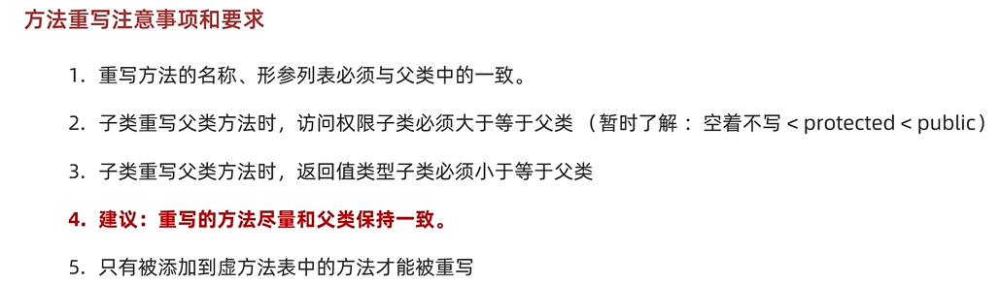
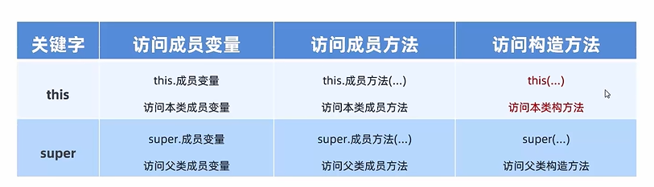
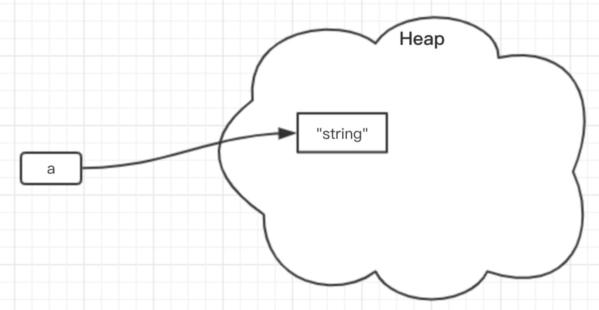
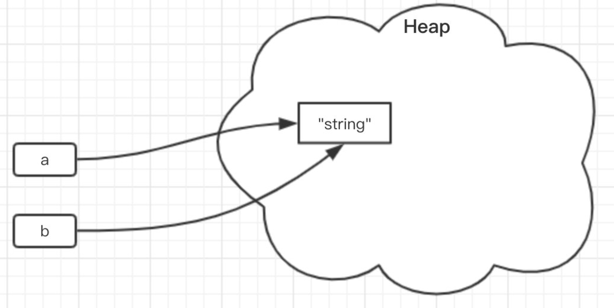
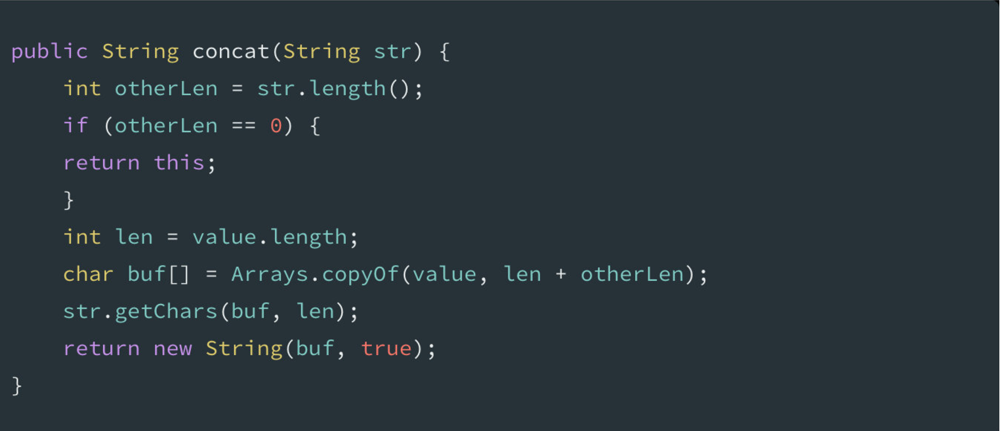
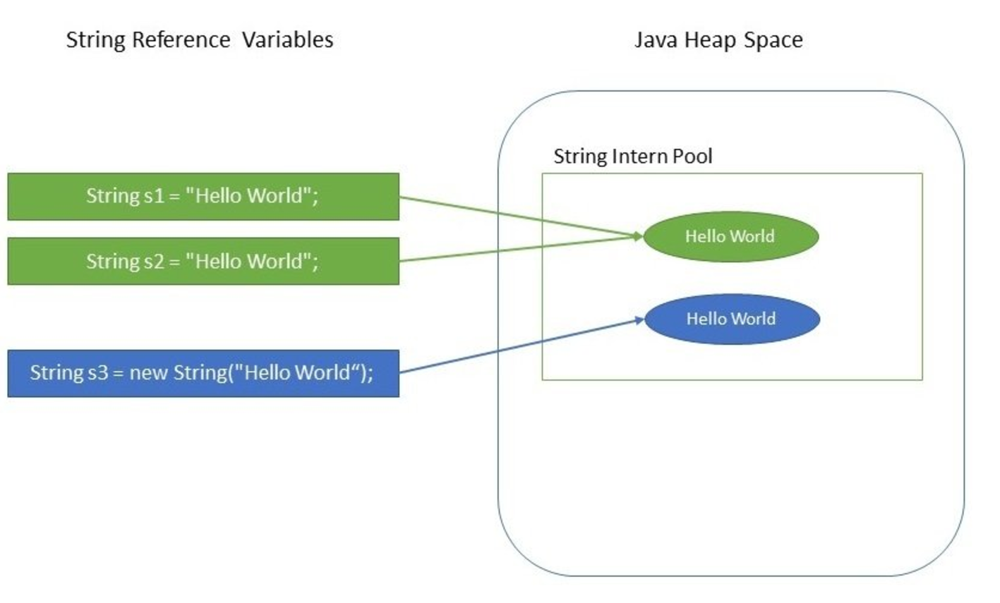

## IO流
### 概论



java 流在处理上分为字符流和字节流。
- 实际上字节流的InputStream和OutputStream是一切的基础。**实际总线中流动的只有字节流**。

- 字符流通常是用来处理**文本数据**，例如字符、字符数组或字符串。存储在磁盘上的数据通常有着各种各样的编码方式，不同的编码方式最终输出的字节内容是不同的，所以，字符流的读取和写入都要设置相应的编码方式。由于字符流在输出前实际上是要完成Unicode码元序列到相应编码方式的字节序列的转换，所以它**会使用内存缓冲区来存放转换后得到的字节序列**，等待都转换完毕再一同写入磁盘文件中。
<br>
   所有文件的储存是都是字节（byte）的储存，在磁盘上保留的并不是文件的字符而是先把字符编码成字节，再储存这些字节到磁盘。在读取文件（特别是文本文件）时，也是一个字节一个字节地读取以形成字节序列。


需要对字节流做特殊解码才能得到字符流。



**字节流在默认情况下是不支持缓存的，字节流在操作时本身不会用到缓冲区，是文件本身直接操作。**
<br>

#### FileInputStream and FileOutPutStream

细节:
1. 创建字节输出流对象
   1. 细节1：参数是字符串表示的路径或者是File对象都是可以的
   2. 细节2：如果文件不存在，会创建一个新的文件，但是要保证父级路径是存在的。
   3. 如果文件已经存在，则会清空文件。


#### 编码相关
1. 不要用字节流读取文本文件
2. 编码解码时使用同一个码表，同一个编码方式


### 一些练习

- 拷贝文件目录(利用递归)
```java
 private static void copydir(File src, File dest) throws IOException {
        File[] files = src.listFiles();
        //进入源文件夹，获取源文件目录

        for (File file : files) {
            if (file.isFile()) {
                FileInputStream fis = new FileInputStream(file);
                FileOutputStream fos = new FileOutputStream(new File(dest, file.getName()));
                byte[] bytes = new byte[1024];
                int len;
                while ((len = fis.read(bytes)) != -1) {
                    fos.write(bytes,0,len);
                }
                fis.close();
                fos.close();
            } else {
                copydir(file, new File(dest, file.getName()));
            }
        }
    }
```

- 对文件进行加密
```java
 String filepath = "C:\\Users\\12099\\Desktop\\FileTest";
        String filename = "copy.mp4";
        File file = new File(filepath, filename);
        FileInputStream fis = new FileInputStream(file);
        FileOutputStream fos = new FileOutputStream("C:\\Users\\12099\\Desktop\\FileTest\\newcopy.mp4");

        //获取待拷贝数组
        byte[] bytes = new byte[1024];
        int len;
        while ((len = fis.read(bytes)) != -1) {
            for (int i = 0; i < bytes.length; i++) {
                bytes[i] = (byte) (bytes[i] ^ '3');
            }
            fos.write(bytes, 0, len);
        }
```

- 对读取的文件进行排序
  文件内容如下：
  "3-4-1-7-2-5"

  ```java
          // 首先是读取文件
        FileInputStream fis = new FileInputStream("src\\a.txt");
        StringBuilder sb = new StringBuilder();

        int ch;
        while ((ch = fis.read()) != -1) {
            sb.append((char) ch);
        }
        System.out.println(sb);

        // 顺利读取数据之后是对数据进行处理
        Integer[] arr = Arrays.stream(sb.toString().split("-"))
                .map(Integer::parseInt).sorted()
                .toArray(Integer[]::new);


        System.out.println(Arrays.toString(arr));
        // 这一段代码还需要好好琢磨

        // 排好序后写入文件
        FileOutputStream fos = new FileOutputStream("src\\a.txt");

        String w = Arrays.toString(arr).replace(", ", "-");
        w = w.substring(1, w.length() - 1);
        byte[] bytes_copy = w.getBytes();
        fos.write(bytes_copy);
  ```

  ```java
  sb.toString().split("-")：
  这部分代码首先将一个StringBuilder对象（假设名为sb）转换为字符串，然后使用split方法根据"-"分隔符将字符串分割成一个字符串数组。
  Arrays.stream(sb.toString().split("-"))：
  
  Arrays.stream方法接受一个数组，并返回一个流（Stream），这个流可以对数组中的元素进行一系列的操作。这里，它将上一步得到的字符串数组转换为一个流。
  
  .map(Integer::parseInt)：
  map是一个中间操作，它将流中的每个元素映射到另一个元素上。这里，map操作接受一个函数Integer::parseInt，这是一个方法引用，它将流中的每个字符串元素转换为Integer类型的值。Integer::parseInt是Integer类的一个静态方法，它接受一个字符串参数并返回该字符串的整数表示。
  
  .sorted()：
  sorted也是一个中间操作，它将流中的元素进行排序。默认情况下，sorted方法使用元素的自然顺序，对于Integer类型，自然顺序就是数值顺序。这意味着流中的整数将被从小到大排序。
  
  .toArray(Integer[]::new)：
  toArray是一个终止操作，它将流中的元素收集到一个数组中。这里，toArray接受一个生成器函数Integer[]::new，这是一个方法引用，它创建了一个新的Integer数组。toArray操作将流中的元素收集到这个新数组中，并返回这个数组。
   ```

### 缓冲流


正如前面提到的，字节流在默认情况下是不支持缓存的，字节流在操作时本身不会用到缓冲区（内存），是文件本身直接操作的，这意味着每调用一次read方法，都会请求操作系统来读取一个字节，这往往会伴随着一次磁盘IO，因此效率会比较低。要使用内存缓冲区来提高读取的效率，我们应该使用**BufferedInputStream**







### 一些练习

- 四种方式拷贝文件，并统计各自用时
  ```java
          // 1. 字节流的基本流

        long startTime = System.currentTimeMillis();

        FileInputStream fis = new FileInputStream("Src\\a.txt");
        FileOutputStream fos = new FileOutputStream("Src\\b.txt");

        int ch;
        while ((ch = fis.read()) != -1) {
            fos.write(ch);
        }
        fis.close();
        fos.close();

        long enTime = System.currentTimeMillis();
        System.out.println(enTime - startTime);
        //
  ```
<br>

  ```java
  // 一次读写一个字节数组
          long startTime = System.currentTimeMillis();

        FileInputStream fis = new FileInputStream("Src\\a.txt");
        FileOutputStream fos = new FileOutputStream("Src\\b.txt");

        byte[] bytes = new byte[2048];
        int len;
        while ((len = fis.read(bytes)) != -1) {
            fos.write(bytes, 0, len);
        }

        fis.close();
        fos.close();

        long enTime = System.currentTimeMillis();
        System.out.println(enTime - startTime);
  ```

  ```java
  // 字节缓冲流，一次读写一个字节
  long startTime = System.currentTimeMillis();
        BufferedInputStream fis = new BufferedInputStream(new FileInputStream("Src\\a.txt"));
        BufferedOutputStream fos = new BufferedOutputStream(new FileOutputStream("Src\\b.txt"));

        int ch;
        while ((ch = fis.read()) != -1) {
            fos.write(ch);
        }

        fis.close();
        fos.close();

        long endTime = System.currentTimeMillis();
        System.out.println(endTime - startTime);
  ```

  ```java
  long startTime = System.currentTimeMillis();
        BufferedInputStream fis = new BufferedInputStream(new FileInputStream("Src\\a.txt"));
        BufferedOutputStream fos = new BufferedOutputStream(new FileOutputStream("Src\\b.txt"));

        byte[] bytes = new byte[2048];
        int len;

        while ((len = fis.read(bytes)) != -1) {
            fos.write(bytes);
        }

        fis.close();
        fos.close();

        long endTime = System.currentTimeMillis();
        System.out.println(endTime - startTime);
  ```

- 拷贝文件，并对文本内容按序号排序
  ```java
          //1.第一步一定是先读入文件
        BufferedReader fis = new BufferedReader(new FileReader("Src\\a.txt"));
        BufferedWriter fos = new BufferedWriter(new FileWriter("Src\\b.txt"));

        // 2. 根据需求，我们可以发现他是一行一句话，那么我们可以用读整行的方法
        Map<Integer, String> s = new TreeMap<>();
        String readstring;
        while ((readstring = fis.readLine()) != null) {
            System.out.println(readstring);
            if (readstring.length() > 0) {
                int index = Integer.parseInt(readstring.substring(0,1));
                s.put(index, readstring);
            }
        }
        byte[] bytes = new byte[1024];

        s.forEach(new BiConsumer<Integer, String>() {
            @Override
            public void accept(Integer integer, String s) {
                try {
                    fos.write(s, 0, s.length());
                    fos.newLine();
                } catch (IOException e) {
                    throw new RuntimeException(e);
                }
            }
        });

        fis.close();
        fos.close();
  ```