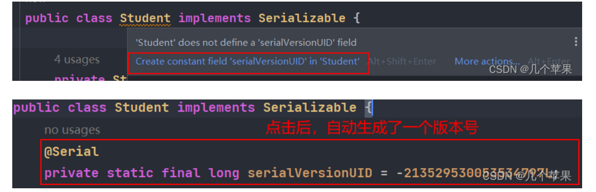
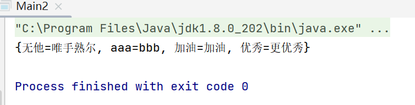

## IO流
### 概论

**输入和输出是相对内存来说的**
输出流是写到硬盘中去
输入流是读到内存中来


java 流在处理上分为字符流和字节流。
- 实际上字节流的InputStream和OutputStream是一切的基础。**实际总线中流动的只有字节流**。

- 字符流通常是用来处理**文本数据**，例如字符、字符数组或字符串。存储在磁盘上的数据通常有着各种各样的编码方式，不同的编码方式最终输出的字节内容是不同的，所以，字符流的读取和写入都要设置相应的编码方式。由于字符流在输出前实际上是要完成Unicode码元序列到相应编码方式的字节序列的转换，所以它**会使用内存缓冲区来存放转换后得到的字节序列**，等待都转换完毕再一同写入磁盘文件中。
<br>
   所有文件的储存是都是字节（byte）的储存，在磁盘上保留的并不是文件的字符而是先把字符编码成字节，再储存这些字节到磁盘。在读取文件（特别是文本文件）时，也是一个字节一个字节地读取以形成字节序列。


需要对字节流做特殊解码才能得到字符流。


**字节流在默认情况下是不支持缓存的，字节流在操作时本身不会用到缓冲区，是文件本身直接操作。**
<br>

#### 字节流FileInputStream and FileOutPutStream

细节:
1. 创建字节输出流对象
   1. 细节1：参数是字符串表示的路径或者是File对象都是可以的
   2. 细节2：如果文件不存在，会创建一个新的文件，但是要保证父级路径是存在的。
   3. 如果文件已经存在，则会清空文件。

**示例**
```java
FileInputStream fis = new FileInputStream("a.txt");
//续写
FileInputStream fis = new FileInputStream("a.txt", true);
FileOutputStream fos = new FileOutputStream("b.txt");

//一次读取一个字节
int ch = 0;
while ((ch = fis.read()) != -1) {
    System.out.println(char(ch));
}

// 一次读取多个字节
byte[] bytes = new byte[1024];
int len = 0;
while ((len = fis.read(bytes)) != -1) {
    system.out.println(new String(bytes, 0, len));

}
```

**拷贝文件**
```java
// 拷贝文件
byte[] bytes = new byte[2024];
int len = 0;
while ((len = fis.read(bytes)) != -1) {
    fos.write(bytes, 0, len);
}

fos.close();    //先关闭写
fis.close();    //再关闭读
```

#### 字符流Read和Write
**相比字节流更适合底层的输入输出，字符流则更适合处理一个文本文件**

- 字符输出流
```java
// 同样(第二个参数设为true，则不会【覆盖】而是【续写】)
FileWriter fw = new FileWriter("a.txt");
FileWriter fw = new FileWriter(new File("a.txt"));

fw.write(int c)
fw.write(char[] cbuf)						// 字符串还需要toCharArray()
fw.write(char[] cbuf, int off, int len)
fw.write(String str)						// 字符串也可以直接写！
fw.write(String str, int off, int len)

fw.flush();
fw.close();


flush与close的区别：
首先要明白，FileWriter和OutputStream的write()方法是不同的———后者是直接写到文件中(因为是字节)；后者是写到内存缓冲区，之后再刷新到文件中(因为是字符)
而flush和close都有立即把缓冲区的数据刷新到文件中的作用————而close还会释放资源，流对象无法再使用了
```

- 字符输入流
```java
// 还是一样的两种构造方法
FileReader fr = new FileReader("a.txt");
FileReader fr = new FileReader(new File("a.txt"));

// 一次读一个字符
int content = 0;
while((content = fr.read()) != -1) {
	System.out.println(char(content));						
}

// 一次读取多个字符
char[] chars = new char[2];
int len = 0;
while ((len = fr.read(chars)) != -1) {
    System.out.println(new String(chars, 0, len));		
}

fr.close();
```


#### 一些练习

- 拷贝文件目录(利用递归)
```java
 private static void copydir(File src, File dest) throws IOException {
        File[] files = src.listFiles();
        //进入源文件夹，获取源文件目录

        for (File file : files) {
            if (file.isFile()) {
                FileInputStream fis = new FileInputStream(file);
                FileOutputStream fos = new FileOutputStream(new File(dest, file.getName()));
                byte[] bytes = new byte[1024];
                int len;
                while ((len = fis.read(bytes)) != -1) {
                    fos.write(bytes,0,len);
                }
                fis.close();
                fos.close();
            } else {
                copydir(file, new File(dest, file.getName()));
            }
        }
    }
```

- 对文件进行加密
```java
 String filepath = "C:\\Users\\12099\\Desktop\\FileTest";
        String filename = "copy.mp4";
        File file = new File(filepath, filename);
        FileInputStream fis = new FileInputStream(file);
        FileOutputStream fos = new FileOutputStream("C:\\Users\\12099\\Desktop\\FileTest\\newcopy.mp4");

        //获取待拷贝数组
        byte[] bytes = new byte[1024];
        int len;
        while ((len = fis.read(bytes)) != -1) {
            for (int i = 0; i < bytes.length; i++) {
                bytes[i] = (byte) (bytes[i] ^ '3');
            }
            fos.write(bytes, 0, len);
        }
```

- 对读取的文件进行排序
  文件内容如下：
  "3-4-1-7-2-5"

  ```java
          // 首先是读取文件
        FileInputStream fis = new FileInputStream("src\\a.txt");
        StringBuilder sb = new StringBuilder();

        int ch;
        while ((ch = fis.read()) != -1) {
            sb.append((char) ch);
        }
        System.out.println(sb);

        // 顺利读取数据之后是对数据进行处理
        Integer[] arr = Arrays.stream(sb.toString().split("-"))
                .map(Integer::parseInt).sorted()
                .toArray(Integer[]::new);


        System.out.println(Arrays.toString(arr));
        // 这一段代码还需要好好琢磨

        // 排好序后写入文件
        FileOutputStream fos = new FileOutputStream("src\\a.txt");

        String w = Arrays.toString(arr).replace(", ", "-");
        w = w.substring(1, w.length() - 1);
        byte[] bytes_copy = w.getBytes();
        fos.write(bytes_copy);
  ```

  ```java
  sb.toString().split("-")：
  这部分代码首先将一个StringBuilder对象（假设名为sb）转换为字符串，然后使用split方法根据"-"分隔符将字符串分割成一个字符串数组。
  Arrays.stream(sb.toString().split("-"))：
  
  Arrays.stream方法接受一个数组，并返回一个流（Stream），这个流可以对数组中的元素进行一系列的操作。这里，它将上一步得到的字符串数组转换为一个流。
  
  .map(Integer::parseInt)：
  map是一个中间操作，它将流中的每个元素映射到另一个元素上。这里，map操作接受一个函数Integer::parseInt，这是一个方法引用，它将流中的每个字符串元素转换为Integer类型的值。Integer::parseInt是Integer类的一个静态方法，它接受一个字符串参数并返回该字符串的整数表示。
  
  .sorted()：
  sorted也是一个中间操作，它将流中的元素进行排序。默认情况下，sorted方法使用元素的自然顺序，对于Integer类型，自然顺序就是数值顺序。这意味着流中的整数将被从小到大排序。
  
  .toArray(Integer[]::new)：
  toArray是一个终止操作，它将流中的元素收集到一个数组中。这里，toArray接受一个生成器函数Integer[]::new，这是一个方法引用，它创建了一个新的Integer数组。toArray操作将流中的元素收集到这个新数组中，并返回这个数组。
   ```

### 缓冲流


正如前面提到的，字节流在默认情况下是不支持缓存的，字节流在操作时本身不会用到缓冲区（内存），是文件本身直接操作的，这意味着每调用一次read方法，都会请求操作系统来读取一个字节，这往往会伴随着一次磁盘IO，因此效率会比较低。要使用内存缓冲区来提高读取的效率，我们应该使用**BufferedInputStream**


- 字符输出缓冲流
```java
BufferedWriter bw = new BufferWriter(new FileWriter(new File("a.txt")));
bw.write("无他");
bw.newLine();
bw.write("唯手熟尔");
bw.close();
```
- 字符输入缓冲流
```java
BufferedRead br = new BufferedReader(new FileReader(new File("b.txt")));
String line = null;
while ((line = br.readLine()) != null ) {//提供了一个读取一整行的方法
    System.out.println(line);
}
br.cloes();
```
与这两个相同，同样需要包裹住之前的实现类
```java
BufferedInputStream bi = new BufferedInputStream(new FileInputStream(new File("a.txt")));

BufferedOutputStream bo = new BufferedOutputStream(new FileOutputStream(new File("a.txt")));

```

#### 一些练习

- 四种方式拷贝文件，并统计各自用时
  ```java
          // 1. 字节流的基本流

        long startTime = System.currentTimeMillis();

        FileInputStream fis = new FileInputStream("Src\\a.txt");
        FileOutputStream fos = new FileOutputStream("Src\\b.txt");

        int ch;
        while ((ch = fis.read()) != -1) {
            fos.write(ch);
        }
        fis.close();
        fos.close();

        long enTime = System.currentTimeMillis();
        System.out.println(enTime - startTime);
        //
  ```
<br>

  ```java
  // 一次读写一个字节数组
          long startTime = System.currentTimeMillis();

        FileInputStream fis = new FileInputStream("Src\\a.txt");
        FileOutputStream fos = new FileOutputStream("Src\\b.txt");

        byte[] bytes = new byte[2048];
        int len;
        while ((len = fis.read(bytes)) != -1) {
            fos.write(bytes, 0, len);
        }

        fis.close();
        fos.close();

        long enTime = System.currentTimeMillis();
        System.out.println(enTime - startTime);
  ```

  ```java
  // 字节缓冲流，一次读写一个字节
  long startTime = System.currentTimeMillis();
        BufferedInputStream fis = new BufferedInputStream(new FileInputStream("Src\\a.txt"));
        BufferedOutputStream fos = new BufferedOutputStream(new FileOutputStream("Src\\b.txt"));

        int ch;
        while ((ch = fis.read()) != -1) {
            fos.write(ch);
        }

        fis.close();
        fos.close();

        long endTime = System.currentTimeMillis();
        System.out.println(endTime - startTime);
  ```

  ```java
  long startTime = System.currentTimeMillis();
        BufferedInputStream fis = new BufferedInputStream(new FileInputStream("Src\\a.txt"));
        BufferedOutputStream fos = new BufferedOutputStream(new FileOutputStream("Src\\b.txt"));

        byte[] bytes = new byte[2048];
        int len;

        while ((len = fis.read(bytes)) != -1) {
            fos.write(bytes);
        }

        fis.close();
        fos.close();

        long endTime = System.currentTimeMillis();
        System.out.println(endTime - startTime);
  ```

- 拷贝文件，并对文本内容按序号排序
  ```java
          //1.第一步一定是先读入文件
        BufferedReader fis = new BufferedReader(new FileReader("Src\\a.txt"));
        BufferedWriter fos = new BufferedWriter(new FileWriter("Src\\b.txt"));

        // 2. 根据需求，我们可以发现他是一行一句话，那么我们可以用读整行的方法
        Map<Integer, String> s = new TreeMap<>();
        String readstring;
        while ((readstring = fis.readLine()) != null) {
            System.out.println(readstring);
            if (readstring.length() > 0) {
                int index = Integer.parseInt(readstring.substring(0,1));
                s.put(index, readstring);
            }
        }
        byte[] bytes = new byte[1024];

        s.forEach(new BiConsumer<Integer, String>() {
            @Override
            public void accept(Integer integer, String s) {
                try {
                    fos.write(s, 0, s.length());
                    fos.newLine();
                } catch (IOException e) {
                    throw new RuntimeException(e);
                }
            }
        });

        fis.close();
        fos.close();
  ```


### 转换流
转换流是一种特殊的字符流，主要包括：
InputStreamReader: 将字节流转换为字符流
    - 通常用于从输入字节流读取字符数据（例如从文件、网络中读取文本）
OutputStreamWriter: 将字符流转换为字节流
    - 通常用于字符数据写入输出字节流（例如写入文件、发送到网络）
#### InputStreamReader
**功能**
- 将字节流转换为字符流
- 使用指定的字符编码将输入的字节数据解码为字符

**构造方法**
```java
InputStreamReader(InputStream in)
InputStreamReader(InputStream in, String charsetName)
// String charsetName：指定字符编码（如 UTF-8、GBK）
```

**示例**
```java
------------------ Demo: System.in是输入字节流，下面把它转化成字符流再用BufferedReader包装 -----------------------

BufferedReader bufferReader = new BufferedReader(new InputStreamReader(System.in));

String line = null;
while((line = bReader.readLine()) != null){
    if(line.equals("exit")){						// 如果输入"exit"就退出
        System.exit(1);
    }
	System.out.println("输入内容:" + line);			// 每次"回车"后，读取一行内容
}

bufferReader.close();

```

#### OutputStreamWriter
**功能**
- 将字符流转换为字节流
- 使用指定的字符编码将字符数据编码为字节后输出

**构造方法**
```java
OutputStreamWriter(OutputStream out)
OutputStreamWriter(OutputStream out, String charsetName)
```

**示例**
```java
try (OutputStreamWriter wrier = new OutputStreamWriter(
    new FileOutputStream("output.txt"), "UTF-8")) {
        writer.write("无他，唯手熟尔");
    } catch (IOException e) {
        e.printStackTrace();
    }
```


### 序列化流
Java中提供了一种对象**序列化**的机制，用一个字节序列可以表示一个对象，该字节序列包含该**对象的数据、对象的类型和对象中存储的属性**等信息。字节序列写出到文件之后，相当于文件中持久保存了一个对象的信息。

反之，该字节序列还可以从文件中读取出来，重构对象，进行**反序列化、对象的数据、对象的类型和对象中存储的数据信息**，都可以用来在内存中创建对象。

#### ObjectOutputStream类
将Java对象的原始数据类型写出到文件，实现对象的持久存储。

**构造方法**
```java
FileOutputStream fileOut = new FileOutputStream("employee.txt");
ObjectOutputStream out = new ObjectOutputStream(fileOut);
```

##### 如何进行序列化
(1) 一个对象要想序列化，必须满足两个条件：
- 该类必须实现**java.io.Serializable** 接口， **Serializable** 是一个标记接口，不实现此接口的类将不会使任何状态序列化或反序列化，会抛出NotSerializableException 。
- 该类的所有属性必须是可序列化的。如果有一个属性不需要可序列化的，则该属性必须注明是瞬态的，使用**transient 关键字**修饰。

```java
public class Student implements Serializable {
    
    private String name;
    private int age;
    
    //transient：瞬态关键字
    //作用：不会把当前属性序列化到本地文件当中
    private transient String address;

    public Student() {
    }

    public Student(String name, int age, String address) {
        this.name = name;
        this.age = age;
        this.address = address;
    }

    public String getName() {
        return name;
    }

    public void setName(String name) {
        this.name = name;
    }

    public int getAge() {
        return age;
    }

    public void setAge(int age) {
        this.age = age;
    }

    public String getAddress() {
        return address;
    }

    public void setAddress(String address) {
        this.address = address;
    }

    public String toString() {
        return "Student{name = " + name + ", age = " + age + ", address = " + address + "}";
    }
}
```

(2) 写出对象的方法
```java
Student stu = new Student("张旭", 20, "江西");

//创建序列化流的对象
ObjectOutputStream oos = new ObjectOutputStream(new FileOutputStream("a.txt"));

// 写出数据
oos.writeObject(stu);

oos.close;
```

#### ObjectInputSteam类
ObjectInputStream反序列化流，就是将前面使用ObjectOutPutStream序列化的原始数据恢复为对象。
**构造方法**
public ObjectInputStream(InputStream in): 创建一个指定InputStream的ObjectInputStream即把爱基本流变成高级流。

##### 如何进行反序列化
找到一个对象的序列化文件，使用**readObject()**方法
```java
ObjectInputStream ois = new ObjectInputStream(new FileInputStream("a.txt"));

Student o = (Student) ois.readObject();

System.out.println(o);

ois.close();
```

###### 反序列化操作问题
当JVM反序列化对象时，能找到class文件，但是class文件在序列化对象之后，实体类进行了修改（比如修改了属性等），那么反序列化操作也会失败，抛出一个InvalidClassException异常。发生这个异常的原因如下：

该类的序列版本号与从流中读取的类描述符的版本号不匹配
该类包含未知数据类型
该类没有可访问的无参数构造方法

idea可以自动设置版本号：


**示例:**
```java
public class Test10 {
    public static void main(String[] args) throws Exception {
        // 创建 学生对象
        Student student = new Student("老王", 23,"北京");
        Student student2 = new Student("老张", 22,"上海" );
        Student student3 = new Student("老李",20,"南京");

        ArrayList<Student> arrayList = new ArrayList<>();
        arrayList.add(student);
        arrayList.add(student2);
        arrayList.add(student3);
        // 序列化操作
         serializ(arrayList);

        // 反序列化
        ObjectInputStream ois  = new ObjectInputStream(new FileInputStream("my-io/list.txt"));
        // 读取对象,强转为ArrayList类型
        ArrayList<Student> list  = (ArrayList<Student>)ois.readObject();
        
        for (Student s : list) {
            System.out.println(s);
        }
        //3.释放资源
        ois.close();

    }

    private static void serializ(ArrayList<Student> arrayList) throws Exception {
        // 创建 序列化流
        ObjectOutputStream oos = new ObjectOutputStream(new FileOutputStream("my-io/list.txt"));
        // 写出对象
        oos.writeObject(arrayList);
        // 释放资源
        oos.close();
    }
}

```

### 配置文件操作IO流
创建一个空的配置文件a.properties
#### 向配置文件中存放数据
Properties集合+IO流: Properties跟IO流结合的操作，向a.properties中写入集合Properties中的数据

```java
public static void main(String[] args) {
        Properties prop = new Properties();
        // 1. 创建集合

        prop.put("aaa", "bbb");
        prop.put("无他", "唯手熟尔");
        prop.put("加油", "加油");
        prop.put("优秀", "更优秀");

        // 1. 方法一
        try(FileOutputStream fos = new FileOutputStream("a.txt");) {
            prop.store(fos, "test");
        } catch (IOException e) {
            throw new RuntimeException(e);
        }

        //2. 方法二
        try(BufferedWriter bw = new BufferedWriter(new FileWriter("a.txt"));) {
            Set<Map.Entry<Object, Object>> entries = prop.entrySet();

            for (Map.Entry<Object, Object> entry : entries) {
                Object key = entry.getKey();
                Object value = entry.getValue();

                bw.write(key + "=" + value);
                bw.newLine();
            }

        } catch (IOException e) {
            throw new RuntimeException(e);
        }

    }
```
方法一：结果如下：


方法二：结果如下：


**别误会，这里的乱码问题纯粹是字节流与字符流的区别**


#### 读取配置文件的数据
Properties结合+IO流：读取配置文件a.properties中的数据，存放到Properties集合中并打印出来
```java
    public static void main(String[] args) {
        // 1. 创建集合
        Properties prop = new Properties();

        // 2. 读取本地Properties文件里面的数据
        try( BufferedReader br = new BufferedReader(new FileReader("a.txt"));) {
            prop.load(br);
        } catch (IOException e) {
            throw new RuntimeException(e);
        }

        //打印集合
        System.out.println(prop);
    }
```



### 一些相关知识的补充
#### IO异常的处理
之前的入门练习，我们一直把异常抛出，但在实际开发中不能这样处理，我们一般使用try catch finally代码块

例如:
```java
FileWriter fw = null;
try {
    fw = new FileWriter("a.txt");
    fw.write("无他，唯手熟尔");
} catch (IOException e) {
    e.printStackTrace();
} finally {
    try {
        if (fw != null) {
            fw.close();
        }
    } catch (IOException e) {
        e.printStackTrace();
    }
}
```

以上又引发一个新的问题，每一次我们都要手动的去释放资源，难免会有遗忘以及本身就很繁琐
因此，可以使用JDK7优化以后得try - with - resource语句
**格式:**
```java
try (创建流对象语句，如果多个，使用";"隔开) {
    //读写数据
} catch (IOException e) {
    e.printStackTrace();
}
```

**示例:**
```java
try (File Writer fw = new FileWriter("a.txt")); {
    //写出数据
    fw.write("无他，唯手熟尔");
} catch (IOException e) {
    e.printStackTrace();
}
```
JDK9中try-with-resource 的改进，对于引入对象的方式，支持的更加简洁。被引入的对象，同样可以自动关闭，无需手动close，我们来了解一下格式。

**改进前**
```java
// 被final修饰的对象
final Resource resource1 = new Resource("resource1");
// 普通对象
Resource resource2 = new Resource("resource2");
// 引入方式：创建新的变量保存
try (Resource r1 = resource1;
     Resource r2 = resource2) {
     // 使用对象
}
```

**改进后**
```java
// 被final修饰的对象
final Resource resource1 = new Resource("resource1");
// 普通对象
Resource resource2 = new Resource("resource2");

// 引入方式：直接引入
try (resource1; resource2) {
     // 使用对象
}
```


#### 编码相关
1. 不要用字节流读取文本文件
2. 编码解码时使用同一个码表，同一个编码方式
https://blog.csdn.net/m0_46202073/article/details/107353201