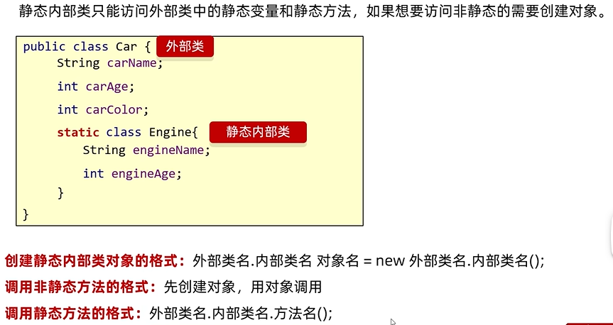

## 内部类

### 内部类的访问特点:
什么是内部类；写在一个类里面的类就叫做内部类。

内部类可以直接访问外部类的成员，包括私有。
外部类要访问内部类的成员，必须创建对象。

***内部类的分类***
- 成员内部类(了解)
- 静态内部类(了解)
- 局部内部类(了解)
- 匿名内部类(掌握)


### 成员内部类
- 写在成员位置的，属于外部类的成员。
- 成员内部类可以被一些修饰符所修饰，比如：private,默认,protected,public等
- 在成员内部类里面，JDK16之前不能定义静态变量，JDK 16开始才可以定义静态变量。

获取成员内部类对象的两种方式：
1. 外部类编写方法，对外提供内部类对象（使用private修饰）
2. 直接创建

格式：外部类名.内部类名 对象名 = 外部类对象.内部类对象；
```java
Outer.Inner oi = new Outer().new Inner();
```

成员内部类如何获取外部类的成员变量。
```java
public class Outer {
  private int a = 10;

  class Inner {
    private int a = 20;

    public void show() {
      int a = 30;
      System.out.println(Outer.this.a);
      System.out.println(this.a);
      System.out.println(a);
    }
  }
}
```

### 静态内部类


注意事项：
- **静态内部类也是成员内部类中的一种**
- 静态内部类只能访问外部类中的静态变量和静态方法。
  如果想要访问非静态的需要创建外部类的对象。
```java
public class Outer {
  int a = 10;
  static int b = 20;

  //静态内部类
  static class Inner {
    public void show1() {
      Outer o = new Outer();
      System.out.println(o.a);//必须要先创建外部类才能访问非静态的变量
      System.out.println(b);//可以直接访问静态变量
    }
  }
}
```

**创建静态内部类的对象，由于是钥匙静态的东西，都可以用类名.直接获取**
所以：
```java
public class Test {
  public static void main(String[] args) {
    Outer.Inner oi = new Outer.Inner();
    oi.show1();
  }
}
```

### 局部内部类
1. 将内部类**定义在方法里面**就叫做局部内部类，类似于方法里面的局部变量。
2. 外界是无法直接使用，需要在方法内部创建对象并使用
3. 该类可以直接访问外部类的成员，也可以访问方法内的局部变量。


### 匿名内部类
```java
public interface Swim {
  public abstract void swim();
}
```
定义一个接口类。
实现：**没有名字的是后面那个{}，Swim是一个接口**
```java
new Swim() {
  @Override
  public void swim() {
    System.out.println("重写的游泳方法");
  }
}
```
```java
public abstract Animal() {
  public abstract void swim();
}
```
定义一个抽象类
继承：**没有名字的是后面那个{},Animal是一个父类**
```java
new Animal {
  @Override
  public void swim() {
    System.out.println("重写了swim方法");
  }
}
```