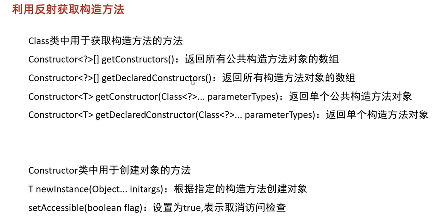

## 反射
反射允许对封装类的字段，方法和构造函数的信息进行编程访问


### 获取class对象的三种方式
1. class.forName("全类名");
2. 类名.class
3. 对象.getClass();

```java
Class clazz1 = Class.forName("com.Student");

//2. 第二种方式
Class clazz2 = Student.class;
synchronized(Student.class) {

}

//3. 第三种方式
//当我们已经有了这个类的对象时，才可以使用
Student s = new Student();
Class clazz3= s.getClass();
```

#### 利用反射获取构造方法



#### 利用反射获取成员变量


#### 利用反射获取成员方法
