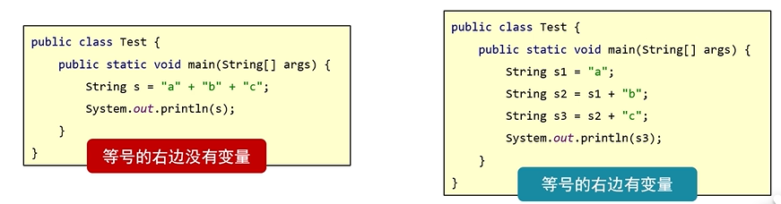
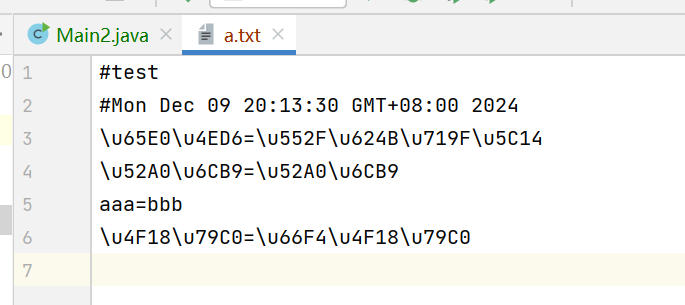
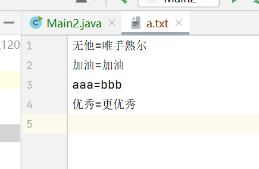
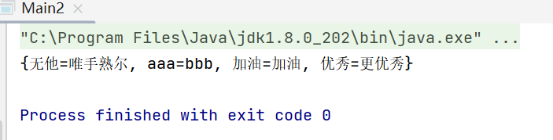

## 字符串常量池
作为最基础的引用数据类型，Java 设计者为 String 提供了字符串常量池以提高其性能，字符串常量池放在了堆内存中。
那么字符串常量池的具体原理是什么，我们带着以下三个问题，去理解字符串常量池：

1、字符串常量池的设计意图是什么？
2、字符串常量池在哪里？
3、如何操作字符串常量池？

***字符串常量池的设计思想***

1、字符串的分配，和其他的对象分配一样，耗费高昂的时间与空间代价，作为最基础的数据类型，大量频繁的创建字符串，极大程度地影响程序的性能。

***2、JVM为了提高性能和减少内存开销，在实例化字符串常量的时候进行了一些优化。***
1）为字符串开辟一个字符串常量池，类似于缓存区。
2）创建字符串常量时，首先***检查***字符串常量池是否存在该字符串。
3）存在该字符串，返回引用实例，不存在，实例化该字符串并放入池中。***就是当使用双引号直接赋值的时候，系统会检查该字符串在串池中是否存在，不存在就创建新的，存在的话就复用***

***3、实现的基础***

1）实现该优化的基础是因为字符串是不可变的，可以不用担心数据冲突进行共享。
2）运行时实例创建的全局字符串常量池中有一个表，总是为池中每个唯一的字符串对象维护一个引用,这就意味着它们一直引用着字符串常量池中的对象，所以，在常量池中的这些字符串不会被垃圾收集器回收。

**使用Scanner 键盘输入的字符串与直接定义的常量字符串使用 == 也会判 false**
```java
Scanner sc = new Scanner(System.in);
System.out.println("请输入一个字符串");
String str1 = sc.next();
String str2 = "abc";
System.out.println(Str1 == str2);
```
***原因：键盘输入最底层源码是new出来的***

## 字符串原理
1. 字符串存储的内存原理
   -直接赋值会复用字符串常量池中已有的
   -new出来不会复用，而是开辟一个新的空间
2. ==号到底比较的是什么？
   -基本数据类型比较数据值
   -引用数据类型比较地址值
3.字符串拼接的底层原理
 
 对于左边的情况，拼接的时候没有变量，都是字符串，出发字符串的优化机制。在编译的时候就已经是最终的结果了。
 
 对于右边的情况，JDK8对字符串的拼接做了优化。在编译时会对字符串长度进行一个一个预估。
 

 总结：在拼接过程中如果有变量参与，都是字符串直接相加，编译之后就是拼接之后的结果，会复用串池中的字符串。
 如果有变量参与，每一行拼接的代码，都会在内存中创建新的字符串，浪费内存。

 ### 面试水题
 
 在编译过程中，就会将"a" + "b" + "c" 拼接为"abc"直接进行字符串常量池的复用。
 

