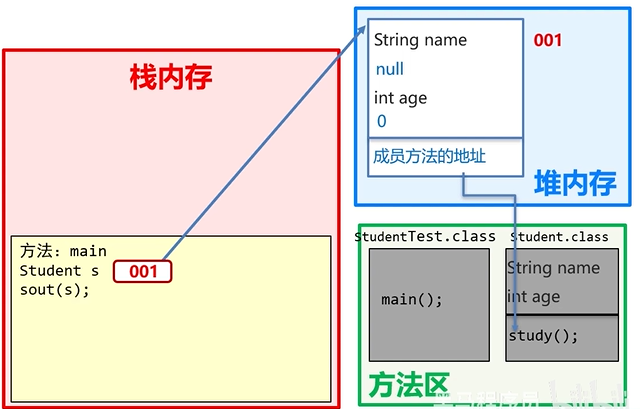

## 对象的内存图
```java
Student s = new Student();
```
new 一个对象之后的操作：
1. 加载class文件
  将对象的class字节码文件加载到方法区，包括对象的所有成员变量和方法。
  
2. 申明局部变量
   ```java
   Student s = new Student();
   ```
   在栈内存中申明新new的对象。

3. 在堆内存中开辟一个空间
   
4. 默认初始化
5. 显示初始化
6. 构造方法初始化
7. 将堆内存中的地址值赋值给左边的局部变量
  

## this的内存原理
this的作用：区分局部变量和成员变量
this的本质：所在方法调用者的地址值

## 成员变量和局部变量的区别
