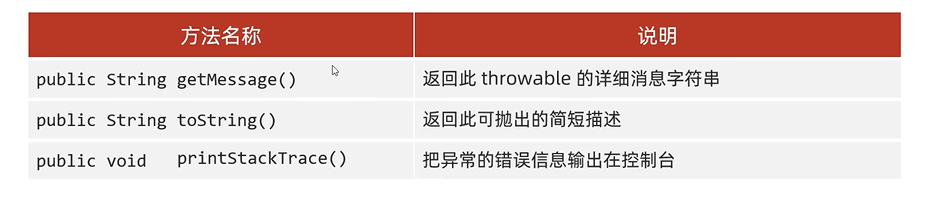
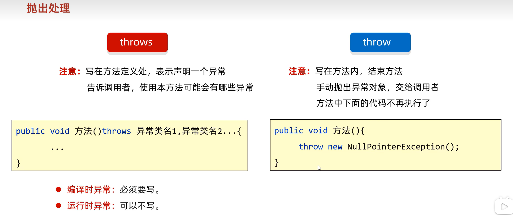

## 异常

### 编译时异常，编译阶段就要进行处理的异常
除了RuntimeException及其子类，其他都是编译时异常。作用在于提醒程序员。

### 运行时异常，RuntimeException及其子类，编译阶段不需要处理。代码运行时出现的异常。

一般是由于参数传递错误带来的问题。

#### JVM默认处理异常的方式：
1. 把异常的名称，异常原因及异常出现的位置灯信息输出在了控制台
2. 程序停止执行，异常下面的代码不会再执行了。

#### 自己处理异常（捕获异常）
```java 
try {
  可能出现异常的代码；
} catch(异常类名 变量名) {
  异常的处理代码；
}
```
可以让程序继续往下执行，不会停止。

问题1. 如果try中没有遇到问题，怎么执行？
  - 不执行catch呗


问题2. 如果try中可能会遇到多个问题，怎么执行？
  - 要写多个catch与之对应，如果我们要捕获多个异常，这些异常中如果存在父子关系的话，那么父类一定要写在下面


问题3. 如果try中遇到的问题没有被捕获，怎么执行？
  - 交给虚拟机执行

问题4. 如果try中遇到了问题，那么try下面的其它代码还会执行吗？
  - 如果try中遇到了问题，下面的代码就不会执行了，会直接跳转到对应的catch中


#### Throwable的成员方法



printStackTrace仅仅是打印信息，不会停止程序运行。

#### throws 和 throw


在方法中，出现异常了，方法就没有继续运行下去的意义了，采取抛出处理。让该方法结束运行并告诉调用者出现了问题。

```java
// throws可以省略不写
public static int getMax(int[] arr) throws NullPointerException, IndexOutOfBoundsException{
        if (arr == null) {
            throw new NullPointerException();
        }

        if (arr.length == 0) {
            throw new IndexOutOfBoundsException();
        }

        int max = arr[0];
        for (int i = 0; i < arr.length; i++) {
            if (arr[i] > max) {
                max = arr[i];
            }
        }

        return max;
    }

```

#### 自定义异常
1. 定义异常类
2. 写继承关系
3. 空参构造
4. 带参构造
为了让控制台的报错信息更加的见名知意

```java
public class NameFormatException extends RuntimeException{
    //技巧：
//    nameFormat: 当前异常的名字，表示姓名格式化问题
//    Exception: 表示当前类是一个异常类 I

    //运行时 继承：RuntimeException   表示由于参数错误而导致的问题
    //编译时: 继承：Exception         核心：提醒程序员检查本地信息

    public NameFormatException() {
    }

    public NameFormatException(String message) {
        super(message);
    }
}
```