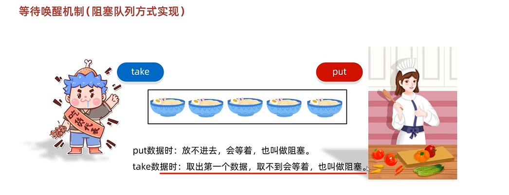
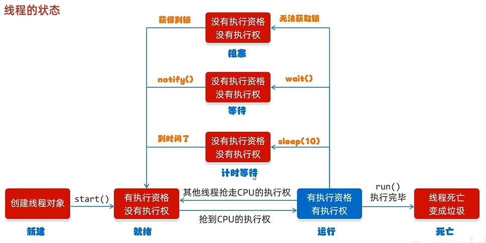
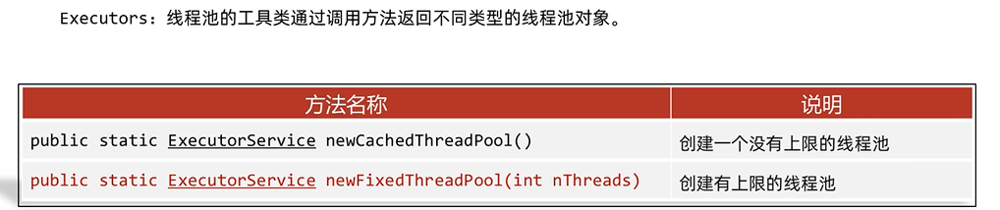

## 抽象类与抽象方法
抽象方法：将**共性的**行为（方法）抽取到父类之后。由于每一个子类执行的内容是不一样的，所以，在父类中不能确定具体的方法体。该方法就可以定义为抽象方法。

抽象类：如果一个类中存在抽象方法，那么该类就必须声明为抽象类。

抽象类和抽象方法的定义格式：
抽象方法的定义格式：
public abstract 返回值类型 方法名(参数列表);

抽象类的定义格式
public abstract class 类型{}

**抽象类和抽象方法的注意事项**

## 接口
**接口就是一种规则，是对行为的抽象**
 
**接口的定义和使用**

**接口中成员的特点**
- 成员变量
  只能是常量，默认修饰符：public static final
- 构造方法
  没有
- 成员方法
  只能是抽象方法
  默认修饰符：public abstract

JDK7以前：接口中只能定义抽象方法。
JDK8的新特性：接口中可以定义有方法体的方法。
JDK9的新特性：接口中可以定义私有方法。

**多个接口中有重名的方法，只需要重写一次**

### 接口与类之间的关系
- **类和类的关系**
继承关系，只能单继承，不能多继承，但是可以多层继承
- **类和接口的关系**
实现关系，可以单实现，也可以多实现，还可以在继承一个类的同时**实现多个接口**。
- *接口和接口的关系**
继承关系，可以单继承，也可以**多继承**。

**JDK8以后接口新增的方法**

**这里不是重写**