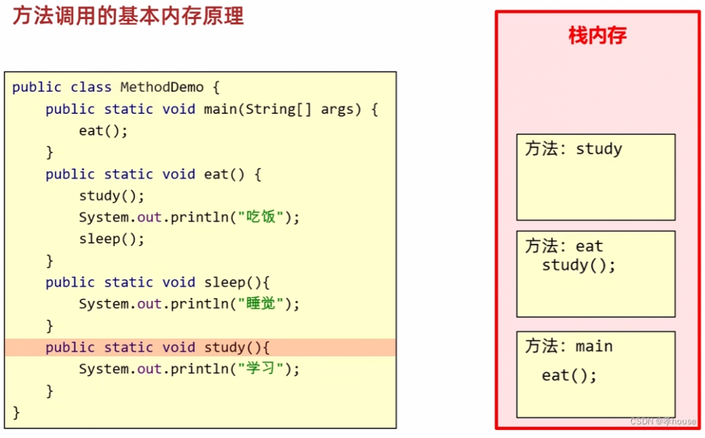
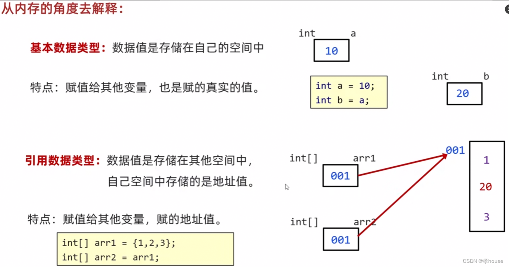

### 方法调用的基本内存原理：
Java中方法调用的基本原理是通过栈来实现的。每当调用一个方法时，就会在栈顶创建一个新的**栈帧**来保存该方法的***参数、局部变量以及方法返回地址***等信息。方法调用结束后，该栈帧会被弹出栈。

在Java中，方法调用可以分为静态方法调用和实例方法调用。静态方法调用是通过类名直接调用静态方法，而实例方法调用则必须通过对象引用来调用。

当方法被调用时，Java虚拟机会首先在方法区中查找该方法的字节码，然后将其加载到内存中，并对其进行解析和验证。接着，Java虚拟机会为该方法创建一个新的栈帧，并将该栈帧推入栈顶。在方法执行期间，Java虚拟机会使用该栈帧来保存方法的各种信息。

当方法调用结束时，Java虚拟机会从栈顶弹出该方法的栈帧，并将栈帧所占用的内存释放掉。此时，程序将回到方法调用的原始位置，并继续执行后面的代码。

如图为例：main方法调用，先进栈，main方法中调用eat方法，eat方法进栈，eat方法中调用study方法，study方法进栈，study方法执行完后出栈。栈是先进后出原理。



基本数据类型：数据值是存储在自己的空间中。

特点：赋值给其他变量，也是赋的真实的值。

范例：

```java
int a = 10;
int b = a;
```

赋值给b的是真实值10

引用数据类型：数据值是存储在其他空间中，自己空间中存储的是地址值。

特点：赋值给其他变量，赋的是地址值。

范例：

```java
int[] arr1 = {1,2,3};
int[] arr2 = arr1;
```
赋值给arr2的是arr1的地址值，指向堆空间的同一块内存


在java中方法传递参数不管是基本数据类型还是引用数据类型都是值传递

基本数据类型传参说明：在JAVA中，方法传递基本数据类型的原理主要是值传递，也就是将实参的值复制一份传递给形参，方法内部对形参的改变不会影响到实参的值。
***如果需要修改值，则需要调用函数return返回***

引用数据类型传参说明：在Java中，方法传递引用数据类型是指方法的参数是引用类型的变量，当这个变量作为参数传递给方法时，实际传递的是引用的地址，而不是对象本身。因此，在方法中修改引用数据类型的值时，会影响原始的对象。（但原理也是值传递，为值传递中的共享对象传递，并不是引用传递）