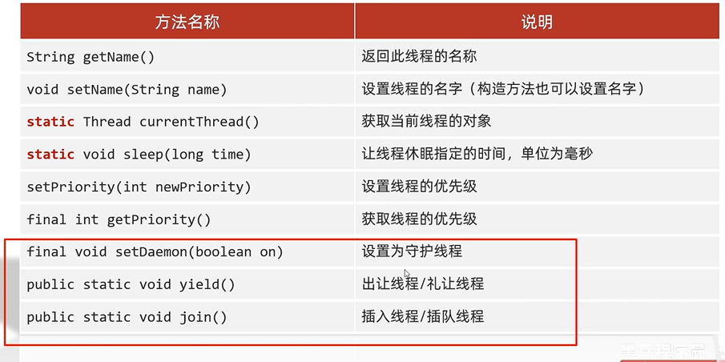
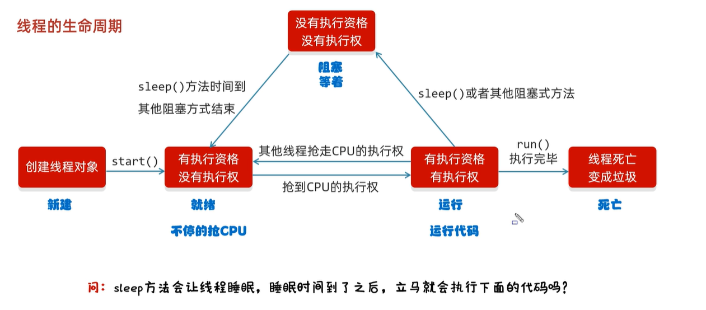
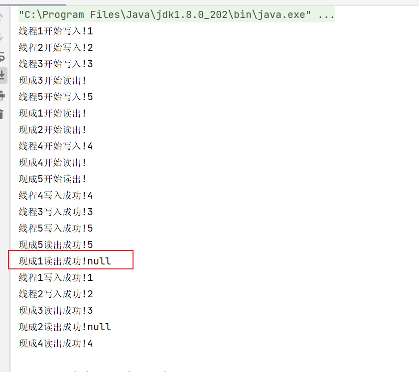
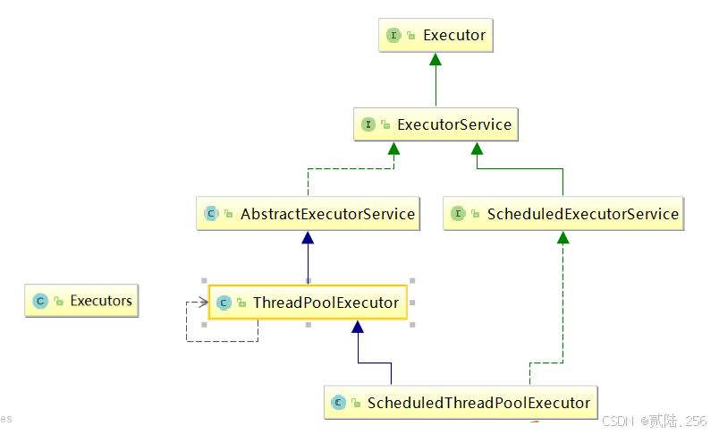
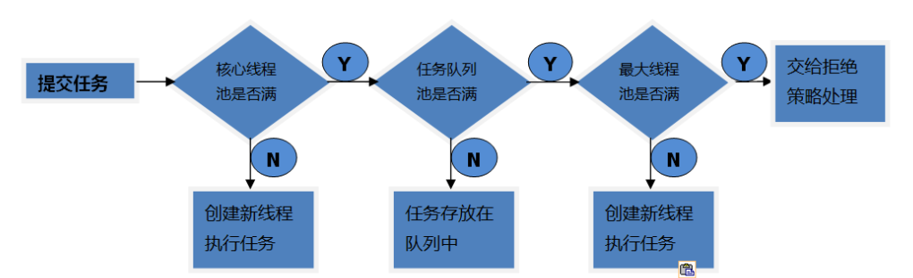

## 线程
线程是操作系统能够进行运算调度的**最小单位**。它被包含在进程之中，是进程中的实际运作单位。

**并发**: 在同一时刻，有多个指令在单个CPU上交替执行
**并行**: 在同一时刻，有多个指令在多个CPU上同时进行

### 多线程的实现方式
#### 继承Thread类的方式进行实现
  ```java
  public class ThreadDemo {
    public static void main(String[] args) {
      MyThread t1 = new MyThread();
      MyThread t2 = new MyThread();

      t1.setName("name1");
      t2.setName("name2");

      t1.start();
      t2.start();
    }
  }

  class MyThread extends Thread{
    @Override
    public void run() {}
    //书写线程要执行的代码
    for (int i = 0; i < 100; i++) {
      System.out.println(getName() + "Hello,World");
    }
  }
  ```
#### 实现Runnable接口的方式进行实现
  1. 自己定义一个类实现Runnable接口
  2. 重写里面的run方法
  3. 创建自己的类的对象
  4. 创建一个Thread类的对象，并开启线程
  ```java
  class MyRun implements Runnable{
    @Override
    public void run() {
      //书写线程要执行的代码
      Thread t = Thread.currentThread();
      for (int i = 0; i < 100; i++) {
        System.out.println(t.getName() + "HelloWorld!");
      }
    }
  }

  public class ThreadDemo {
    MyRun mr = new MyRun();
    Thread t1 = new Thread(mr);
    Thread t1 = new Thread(mr);

    t1.start();
    t2.start();
  }
  ```
#### 利用Callable接口和Future接口方式实现

**Thread和Runable接口使得多线程编程简单直接，但Thread和Runnable接口都不允许声明检查项异常，也不能定义返回值。**


  1. 创建一个类MyCallable实现Callable接口
  2. 重写call（是有返回值的，表示多线程运行的结果）
  3. 创建MyCallable的对象（表示多线程要执行的任务）
  4. 创建FutureTask的对象（作用管理多线程运行的结果）
  5. 创建Thread类的对象，并启动（表示线程）

  ```java
  public class MyCallable implements Callable<Integer> {
    @Override
    public Integer call() throws Exception {
      int sum = 0;
      for (int i = 1; i <= 100; i++) {}
      sum = sum + i;
    }

    return sum;
  }
  ```

  ```java
  public class ThreadDemo Throws ExecutionException{
    public static void main(String[] args) {
      // 创建MyCallable的对象（表示多线程要执行的任务)
      MyCallable mc = new MyCallable();
      FutureTask<Integer> ft = new FutureTask<>(mc);

      Thread t1 = new Thread(ft);
      t1.start();

      //获取多线程运行的结果
      Integer result = ft.get();
      System.out.println(result);
    }
  }
  ```


### 常见的成员方法


Java中使用的是抢占式调度，是随机的，谁的优先级更大，谁抢到的概率就更大

最大的优先级是10，最小的是1，默认为5

#### 守护线程
  当其他的非守护线程执行完毕，守护线程会陆续结束
  Thread t2 = new MyThread();
  T2.setDaemon(True);


### 线程的生命周期
1. 新建状态：创建线程对象  start()
2. 就绪状态：有执行资格，没有执行权  
3. 运行状态：有执行资格并且有执行权
4. 阻塞状态：没有执行资格，也没有执行权
5. 死亡状态：线程死亡，变成垃圾



### 线程安全
多个线程操作同一个数据的时候可能会出现问题
可以使用同步代码块或者同步方法来解决 synchronized
```java
public class MyThread extends Thread{
  static int ticket = 0;

  static Object obj = new Object();

  @Override
  public void run() {
    while (true) {
      synchronized(obj) {
        if (ticket < 100) {
          try {
            Thread.sleep(100);
          } catch (InterruptedException e) {
            e.printStackTrace();
          }
        }

        ticket++;
        System.out.println("同步代码块");
      } else {
        break;
      }
    }
  }
}
```

同步方法
就是把synchronized关键字加到方法上
格式：
```java
修饰符 synchronized 返回值类型 方法名（方法参数）{...}
```
**这个时候锁的对象是当前实例即this**

#### Lock锁
**ReentrantLock**
1. 公平锁: 十分公平，可以先来后到，一定要排队(传参为true为公平锁)
2. 十分不公平，可以插队(无参构造)
Lock接口
```java
public class SaleTicketDemo {
    public static void main(String[] args){
        Ticket ticket = new Ticket();

        new Thread(() -> {for(int i = 0; i < 40; i++) ticket.sale();}, "线程1").start();
        new Thread(() -> {for(int i = 0; i < 40; i++) ticket.sale();}, "线程2").start();
        new Thread(() -> {for(int i = 0; i < 40; i++) ticket.sale();}, "线程3").start();
    }
}

class Ticket {
    private int ticketNUm = 30;
    private Lock lock = new ReentrantLock();

    public void sale() {
        lock.lock();
        try {
            if (this.ticketNUm > 0) {
                System.out.println(Thread.currentThread().getName() + "余票" + --ticketNUm);
            }
            Thread.sleep(1000);
        }catch (Exception e) {
            e.printStackTrace();
        } finally {
            lock.unlock();
        }
    }

}
```
##### 可重入锁
可重入锁又名递归锁，是指在同一个线程中，外层方法获取锁的时候，再进入该线程的内层方法会自动获取锁。Java中ReentrantLock和synchronized都是可重入锁，可重入锁的一个优点是可一定程度的避免死锁
- 使用synchronized实现可重入锁
```java
public class ReentrantLockDemo {
  public synchronized void methodA() {
    System.out.println("方法A");
    methodB();
  }

  public synchronized void methodB() {
    System.out.println("方法B");
  }
}
```

- 使用ReentrantLock实现可重入锁
```java
  public class ReentrantLockDemo2 {
    private ReentrantLock lock = new ReentrantLock();

    public void methodA() {
      lock.lock();
      try {
        System.out.println("方法A");
        methodB();
        }catch {
      lock.unlock();
        }
    }

    public void methodB() {
      lock.lock();
      try {
      System.out.println("方法B");
      } catch {
      lock.unlock();
      }
    }
  }
```

##### 公平锁
ReentrantLock还可以实现公平锁。所谓公平锁，就是在锁上等待时间最长的线程优先获得锁的使用权。通俗的理解就是谁排队时间最长，谁先获取锁。
公平锁不允许插队，非公平锁允许插队
```java
public class Main2 {
    public static void main(String[] args){
        FariLockDemo demo = new FariLockDemo();

        for (int i = 1; i <= 5; i++) {
            Thread t = new Thread( () -> {
                demo.testMethod();
            }, "线程" + i);
            t.start();
        }
    }
}

class FariLockDemo {
    private final ReentrantLock lock = new ReentrantLock(true);

    public void testMethod() {
        try {
            lock.lock();
            System.out.println(Thread.currentThread().getName() + "获得了锁");
            Thread.sleep(200);
        } catch (Exception e) {
            e.printStackTrace();
        } finally {
            lock.unlock();
            System.out.println(Thread.currentThread().getName() + "释放了锁");
        }
    }
}
```

**公平锁:** 公平锁通过一个队列来管理多个线程的请求顺序，确保线程按照进入等待队列的顺序获取锁。避免了某些线程被长时间“插队”而导致的饥饿问题。
**非公平锁:** 极端情况下可能会导致某些线程长时间等待，因为新的线程有可能会插队直接获取锁。公平锁虽然能避免这种情况，但可能会带来性能上的开销，因为需要维护一个有序的队列。
**使用场景:** 公平锁适用于对公平性要求较高的场景，比如多个线程需要公平竞争资源、避免某些线程被长期占用而"饿死"

##### synchronized 和 lock锁的区别
1. synchronized内置的java关键字,Lock是一个java类
2. synchronized无法判断获取锁的状态, Lock可以判断是否获取到了锁
3. synchronized会自动释放锁,Lock必须要手动释放锁!如果不是释放锁,会产生死锁
4. synchronized 线程1(获得锁,阻塞),线程2(等待); Lock锁就不一定会等待下去
5. synchronized 可重入锁,不可以中断的,非公平的; Lock锁,可重入的,可以判断锁,非公平(可自己设置);
6. synchronized 适合锁少量的代码同步问题,Lock 适合锁大量的同步代码


##### ReentrantReadWriteLock读写锁
在一些业务场景中，大部分只是读数据，写数据少，如果仅仅是读数据的话并不会影响数据的正确性，而如果在这种业务场景下，依然使用独占锁的话，很明显会出现性能瓶颈的地方。
针对这种读多写少的情况，java还提供了另外一个实现Lock接口的ReentrantReadWWriteLock(读写锁)。
```java
public class Main2 {
    public static void main(String[] args){
        MyCache cache = new MyCache();

        //启动5个写线程
        for (int i = 1; i <= 5; i++) {
            String num = String.valueOf(i);
            new Thread(() -> {
                cache.put(num, num);
            }, "线程" + i).start();
        }

        // 启动5个读进程
        for (int i = 1; i <= 5; i++) {
            String num = String.valueOf(i);

            new Thread(() -> {
                cache.get(num);
            }, "现成" + i).start();
        }
    }
}

class MyCache {
    private Map<String, String> cache = new HashMap<>();

    public void put(String key, String value) {
        try {
            System.out.println(Thread.currentThread().getName() + "开始写入!" + value);
            Thread.sleep(300);
            //模拟写操作的延迟

            cache.put(key, value);

            System.out.println(Thread.currentThread().getName() + "写入成功!" + value);
        } catch (InterruptedException e) {
            e.printStackTrace();
        }
    }

    public void get (String key) {
        try {
            System.out.println(Thread.currentThread().getName() + "开始读出!");

            Thread.sleep(300);

            String value  = cache.get(key);

            System.out.println(Thread.currentThread().getName() + "读出成功!" + value);;
        } catch (InterruptedException e) {
            e.printStackTrace();
        }
    }
}
```

废话不多说：看截图：很明显出现读写错误问题，不具备原子性


**而如果读和写的方法分别加入独占式锁，那么读写效率就会变得很低**
因此使用读写锁
```java
public final ReentrantReadWriteLock readWriteLock = new ReentrantReadWriteLOck();

```
修改代码如下：
```java
public class Main2 {
    public static void main(String[] args){
        MyCache cache = new MyCache();

        //启动5个写线程
        for (int i = 1; i <= 5; i++) {
            String num = String.valueOf(i);
            new Thread(() -> {
                cache.put(num, num);
            }, "线程" + i).start();
        }

        // 启动5个读进程
        for (int i = 1; i <= 5; i++) {
            String num = String.valueOf(i);

            new Thread(() -> {
                cache.get(num);
            }, "现成" + i).start();
        }
    }
}

class MyCache {

    private final ReentrantReadWriteLock lock = new ReentrantReadWriteLock();

    private Map<String, String> cache = new HashMap<>();

    public void put(String key, String value) {
        lock.writeLock().lock();
        try {
            System.out.println(Thread.currentThread().getName() + "开始写入!" + value);
            Thread.sleep(300);
            //模拟写操作的延迟

            cache.put(key, value);

            System.out.println(Thread.currentThread().getName() + "写入成功!" + value);
        } catch (InterruptedException e) {
            e.printStackTrace();
        } finally {
            lock.writeLock().unlock();
        }
    }

    public void get (String key) {
        lock.readLock().lock();
        try {
            System.out.println(Thread.currentThread().getName() + "开始读出!");

            Thread.sleep(300);

            String value  = cache.get(key);

            System.out.println(Thread.currentThread().getName() + "读出成功!" + value);;
        } catch (InterruptedException e) {
            e.printStackTrace();
        } finally {
            lock.readLock().unlock();
        }
    }
}
```
**锁降级策略**
```
锁降级是一种多线程编程中的一种锁策略，它指的是在持有某个锁的同时，降低该锁的粒度，也就是将一个较大粒度的锁替换为一个较小粒度的锁。这通常是为了减少锁的竞争，提高程序的并发性能。

锁降级的典型场景是在持有某个写锁时，释放写锁并获取读锁。这样做的好处是在执行读操作期间，其他线程可以同时执行读操作，提高了并发性能。
```

#### 别人博客的Tip
```java
class Phone {
 
    public synchronized void sendSMS() {
        TimeUnit.SECONDS.sleep(4);
        System.out.println("sendSMS");
    }
    
 
    public synchronized void sendEmail() {
        System.out.println("sendEmail");
    }
 
    public void hello() {
        System.out.println("hello");
    }
 
}
 
public class Lock8 {
    
    public static void main(String[] args) {
 
        //  线程操作资源类
        Phone phone = new Phone();
 
        //  调用短信
        new Thread(()->{
            phone.sendSMS();
        }).start();
 
        //  调用邮件
        new Thread(()->{
            phone.sendEmail();
        }).start();
    }
}
```

- 一部手机，两个线程，一个线程先访问短信，另一个线程再访问邮件，先打印短信还是邮件
  
- 停4秒在短信方法内，先打印短信还是邮件

- 先访问短信，再访问hello方法，是先打短信还是hello

- 现在有两部手机，第一部发短信，第二部发邮件，先打印短信还是邮件

- 两个静态同步方法，一部手机，先打印短信还是邮件

- 两个静态同步方法，两部手机，先打印短信还是邮件

- 1个静态同步方法，一个普通同步方法，一部手机，先打印短信还是邮件

- 1个静态同步方法，一个普通同步方法，两部手机，先打印短信还是邮件

```
1. 先访问短信，再访问邮件，先打印短信还是邮件
    先短信再邮件！
    两个方法都是属于同步方法：正常按照顺序执行，本质：cup 资源抢占， 都有锁！同时这个两个方法使用的锁是同一把锁！
 
2. 停4秒在短信方法内，先打印短信还是邮件
    先短信再邮件！
    原因：短信与邮件使用的是同一把锁 ，那么这个锁是谁？ this
 
3. 先访问短信，再访问hello方法，是先打短信还是hello
    先hello ，再短信！
    原因：一个有锁，一个没有锁！然后按照顺序执行, 短信中有睡眠,hello 中没有，先执行hello！
 
4. 现在有两部手机，第一部发短信，第二部发邮件，先打印短信还是邮件
    Phone phone = new Phone();
    Phone phone2 = new Phone();
    先邮件，再短信！
    原因：两个同步方法使用的不是同一把锁：因为对象变了 ，phone ,phone2
 
5. 两个静态同步方法，1部手机，先打印短信还是邮件
    先短信，再邮件
    因为同一把锁，那么这个锁是谁? Phone.class
 
    静态方法随着类的加载而加载，此时没有对象！
 
6. 两个静态同步方法，2部手机，先打印短信还是邮件
    先短信，再邮件：
       Phone phone = new Phone();    Phone phone2 = new Phone();
    原因：同一把锁！    phone and phone2 都是来自于同一个元模板： Phone.class
 
7. 1个静态同步方法，1个普通同步方法，1部手机，先打印短信还是邮件
    先邮件，再短信
    原因：短信锁，Phone.class  邮件锁，this
 
8. 1个静态同步方法，1个普通同步方法，2部手机，先打印短信还是邮件
    先邮件，再短信
    原因：短信锁Phone.class  邮件锁this
```

#### 死锁问题
在工程中，注意不要让两个锁嵌套，一般就不会有问题


### 线程通信
先给你来一道面试题：
```
两个线程，一个线程打印1-52,另外一个打印字母A-Z，打印顺序为12A34B...5252Z，要求用线程间的通信
```
```java
public class ThreadCommunicationDemo {
  private final Object lock = new Object();

  private boolean printNumber = true;

  public static void main(String[] args) {
    ThreadCommunicationDemo demo = new ThreadCommunicationDemo();
    demo.startThrads();
  }

  public void startThreads() {
    //创建并启动数字线程
    Thread numberThread = new Thread(() -> {
      for (int i = 1; i<= 52; i++) {
        synchronized (lock) {
          while (!printNumber) {
            try {
              lock.wait();
            } catch (InterruptedException e) {
              Thread.currentThread().interrupt();
            }
          }
        }
        //打印数字
        System.out.println(i < 10 ? "0" + i : i);//针对0-9
        if (i % 2 == 0) {
          System.out.println(" ");//每两个数字时间添加空格
      }
      printNumber = false;
      lock.notify();
    });

    // 创建并启动字母线程
        Thread letterThread = new Thread(() -> {
            char letter = 'A';
            for (int i = 1; i <= 26; i++) {
                synchronized (lock) {
                    while (printNumber) {
                        try {
                            lock.wait(); // 等待数字线程的通知
                        } catch (InterruptedException e) {
                            Thread.currentThread().interrupt();
                        }
                    }
                    // 打印字母
                    System.out.print(letter);
                    letter++;
                    printNumber = true;
                    lock.notify(); // 通知数字线程
                }
            }
        });
 
        // 启动两个线程
        numberThread.start();
        letterThread.start();
 
        // 等待线程完成
        try {
            numberThread.join();
            letterThread.join();
        } catch (InterruptedException e) {
            Thread.currentThread().interrupt();
        }

  }
}
```

#### 模板
1. 判断
2. 干活
3. 通知


#### 生产者和消费者(等待唤醒机制)
生产者消费者模式是一个十分经典的多线程协作的模式
消费者： 消费数据
生产者： 生产数据

##### 第一种方式
```java
public class Desk {
  public static int foodFlag = 0;

  // 总个数
  public static int count = 10;

  //锁对象
  public static Object lock = new Object();
}
```


```java
public class Foodie extends Thread{

  @Override
  public void run() {
    while (true) {
      synchronized(Desk.lock) {
        if (Desk.count == 0) {
          break;
        } else {
          //先判断桌子上是否有面条
          if (Desk.foodFlag == 0) {
            try {
              Desk.lock.wait();
            //用锁对象来调用wait方法
            } catch (InterruptedException e) {
              e.printStackTrace();
            }
          } else {
            System.out.println("吃货在吃面条，还能再吃" + Desk.count + "碗!!!");
            Desk.lock.notifyAll();
            Desk.count--;
            Desk.foodFlag = 0;
          }
        }
      }
    }
  }
}
```

```java
public class Cook extends Thread {
  @public void run() {

    while (true) {
      synchronized (Desk.lock) {
        if (Desk.count == 0) {
          break;
        } else {
          if (Desk.foodFlag == 1) {
            //判断桌子上是否有食物
            try {
              Desk.lock.wait ();
              } catch (InterruptedException e) {
                e.printStackTrace();
              }
            } else {
              System.out.println("厨师做了一碗面条");
              Desk.foodFlag = 1;
              Desk.lock.notifyAll();
            }
          }
        }
      }
    }
  }
}
```

##### 第二种方式（阻塞队列BlockingQueue）
  
**作为BlockingQueue的使用者，不需要关心什么时候需要阻塞线程，什么时候需要唤醒线程，因为这一切BlockingQueue都给你一手包办了**

  生产者和消费者必须要使用同一个阻塞队列
  ```java
  public class Cook extends Thread{
    ArrayBlockingQueue<String> queue;

    public Cook(ArrayBlockingQueue<String> queue) {
      this.queue = queue;
    }

    @Override
    public void run() {
      while (true) {
        try {
          queue.put("面条");
          System.out.println("厨师做了一碗面条");
        } catch {
          e.printStackTrace();
        }
      }
    }
  }
  ```

  ```java
  public class Foodie extends Thread{
    ArrayBlockingQueue<String> queue;

    public Foodie(ArrayBlockingQueue<String> queue) {
      this.queue = queue;
    }

    @Override
    public void run() {
      while (true) {
        try {
          String food = queue.take();
        } catch (InterruptedException e) {
          e.printStackTrace();
        }
      }
    }
  }
  ```

  ```java
  public class Test() {
    public void static main(String[] args) {
      ArrayBlockingQueue<String> queue = new ArrayBlockingQueue(1);

      COol c = new Cook(queue);
      Foodie f = new Foodie(queue);

      c.start();
      f.start();
    }
  }
  ```


  #### 线程的状态
   


### 线程池

线程池可以减少在创建和销毁线程上所消耗的时间以及系统资源的开销，解决资源不足的问题。如果不使用线程池，有可能造成系统创建大量同类线程而导致消耗完内存或者“过度切换”的问题。

**面试题：execute和submit的区别**
1. execute是Executor接口的方法，而submit是ExecutorService的方法，并且ExecutorService接口继承了Executor接口。
2. executr只接受Runnable参数，没有返回值；而submit可以接受Runnable参数和Callable参数，并且返回了Future对象，可以进行任务取消、获取任务结果、判断任务是否执行完毕/取消等操作。
3. 通过execute方法提交的任务无法获取具体的异常信息；而submit方法可以通过Future对象获取异常信息。


核心原理：
1. 创建一个池子，池子中是空的
2. 提交任务时，池子会创建新的线程对象，任务执行完毕，线程归还给池子。下回再次提交任务时，不需要创建新的线程，直接复用已有的线程即可
3. 但是如果提交任务时，池子中没有空间线程，也无法创建新的线程，任务就会排队等待。
**代码实现**

```java
ExecutorService pool1 = Executors.newCachedThreadPool();
```


#### 单线程池 Executors.newSingleThreadExecutor();
```java
public static void main(String[] args){
        ExecutorService threadPool = Executors.newSingleThreadExecutor();

        try {
            for (int i = 0; i < 1000; i++) {
                //向线程池提交任务，线程池会安排线程执行该任务
                threadPool.execute( ()-> {
                    System.out.println(Thread.currentThread().getName() + "开始执行业务逻辑");
                    try {
                        TimeUnit.MILLISECONDS.sleep(50);
                    }catch (InterruptedException e) {
                        e.printStackTrace();
                    }
                    System.out.println(Thread.currentThread().getName() + "结束");
                });
            }
        } catch (Exception e) {
            e.printStackTrace();
        } finally {
            threadPool.shutdown();
        }
    }
```

#### 延迟执行 Executors.newScheduledThreadPool(3)
```java
public static void main(String[] args){
        ScheduledExecutorService scheduledThreadPool = Executors.newScheduledThreadPool(3);
        //创建一个定长线程池,可以调度任务按指定时间间隔或延迟执行

        System.out.println("当前时间:" + new Date());

        try {
          /*
          第一个参数表示要执行的任务
          第二个参数表示时间
          第三个参数表示单位（秒，时，分）
          */
            scheduledThreadPool.schedule( ()-> {
                System.out.println(Thread.currentThread().getName() + "定时任务被执行");
                System.out.println("当前时间:" + new Date());

                //模拟任务执行需要时间:
                try {
                    TimeUnit.SECONDS.sleep(2);
                }catch (InterruptedException e) {
                    throw new RuntimeException();
                }
            }, 5, TimeUnit.SECONDS);//延迟5s执行这个任务
        } finally {
            scheduledThreadPool.shutdown();
        }

    }
```

#### 定时任务：延迟并间隔执行
```java
    public static void main(String[] args) {

        // 创建一个定长线程池，支持定时和周期性任务调度
        ScheduledExecutorService scheduledThreadPool = Executors.newScheduledThreadPool(3);

        // 打印当前时间，用于对比任务执行时间
        System.out.println("当前时间: " + new Date());

        // 使用 scheduleAtFixedRate() 方法，进行固定频率的周期性任务调度
        // 参数：
        // 第一个参数为要执行的任务
        // 第二个参数为首次延迟的时间，设置为5秒
        // 第三个参数为周期性任务的时间间隔，设置为1秒
        // 第四个参数为时间单位，这里使用 TimeUnit.SECONDS 表示秒
        scheduledThreadPool.scheduleAtFixedRate(() -> {
            // 打印当前线程名称和执行时间
            System.out.println(Thread.currentThread().getName() + " 定时任务被执行: " + new Date());
        }, 5, 1, TimeUnit.SECONDS);

        // 注意：不要关闭线程池，因为该任务会以固定的间隔持续执行
        // scheduledThreadPool.shutdown();  // 如果关闭线程池，任务将无法继续执行
    }
```

#### 线程池的底层原理
##### 七个重要的参数

1. corePoolSize: 线程池中的常驻核心线程数
2. maximumPoolSize: 线程池能够容纳同时 执行的最大线程数，此值必须大于等于1
3. keepAliveTIme: 多余的空闲线程的存活时间，当前池中线程数量超过corePoolSize时，当空闲时间达到keepAliveTime时，多余线程会被销毁直到只剩下corePoolSize个线程为止
4. unit: keepAliveTime的单位
5. workQueue: 任务队列，被提交但尚未被执行的任务
6. threadFactory: 表示生成线程池中工作线程的线程工厂，用于创建线程，一般默认的即可
7. handler: 拒绝策略，表示当队列满了，并且工作线程等于线程池的最大线程数(maximumPoolSize)时，如何来拒绝请求执行的runnable的策略

##### 线程池底层工作原理

1. 在创建了线程池后，线程池中的线程数位0
2. 当调用execute()方法添加一个请求任务时，线程池会做出如下判断:
   1. 如果正在运行的线程数量小于corePoolSize,那么马上创建线程运行这个任务
   2. 如果正在运行的线程数量大于或等于corePoolSize，那么将这个任务放入队列
   3. 如果这个时候队列满了，且正在运行的线程数量还小于maximumPoolSize，那么还是要创建非核心线程李科运行这个任务
   4. 如果队列满了且正在运行的线程数量等于maximumPoolSize，那么线程池会启动饱和拒绝策略来执行
3. 当一个线程完成任务时，它会从队列中取下一个任务来执行.
4. 当一个线程无事可做超过keepAliveTime时，线程会判断:
   1. 如果当前运行的线程数大于corePoolSize那么这个线程就会被停掉。
   2. 线程池的所有任务完成后，他最终会收缩到corePoolSize的大小。

##### 自定义线程池

在《阿里巴巴java开发手册》中指出了线程资源必须通过线程池提供，不允许在应用中自行显示的创建线程，这样一方面是线程的创建更加规范，可以合理控制开辟线程的数量；另一方面线程的细节管理交给线程池处理，优化了资源的开销。而线程池不允许使用Executors去创建，而要通过ThreadPoolExecutor方式，这一方面是由于jdk中Executor框架虽然提供了如newFixedThreadPool()、newSingleThreadExecutor()、newCachedThreadPool()等创建线程池的方法，但都有其局限性，不够灵活；使用ThreadPoolExecutor有助于大家明确线程池的运行规则，创建符合自己的业务场景需要的线程池，避免资源耗尽的风险
```java
public static void main(String[] args) {
        ExecutorService threadPool = new ThreadPoolExecutor(
                2,//corePoolSize: 核心线程池大小，始终保持运行的线程数
                5,//maximumPoolSize: 最大线程池大小，当任务量增加时，线程池可以扩展到这个大小
                2,//keepAliveTime: 非核心线程的闲置超时时间
                TimeUnit.SECONDS,//keepAliveTIme
                new ArrayBlockingQueue<>(3),//工作队列，用于存放等待执行的任务
                Executors.defaultThreadFactory(),//线程工厂，用于创建新的线程
                new ThreadPoolExecutor.AbortPolicy()//拒绝策略，处理无法执行的任务
        );

        //提交任务到线程池
        try{
            for (int i = 0; i < 9; i++) {
                threadPool.execute(() -> {
                    System.out.println(Thread.currentThread().getName() + "执行业务逻辑");

                    try {//模拟执行业务逻辑时间 3s
                        TimeUnit.SECONDS.sleep(3);
                    } catch (InterruptedException e) {
                        e.printStackTrace();
                    }
                });
            }
        } catch (Exception e) {
            e.printStackTrace();
        } finally {
            threadPool.shutdown();
        }
    }
```


### 练习
1. 抢红包也用到了多线程，假设：100块，分成了3个包，现在有5个人去抢。
   其中，红包是共享数据。
   5个人史5条线程。

   打印结果如下：
        XXX抢到了XXX元
        XXX抢到了XXX元
        XXX没抢到
        XXX没抢到


