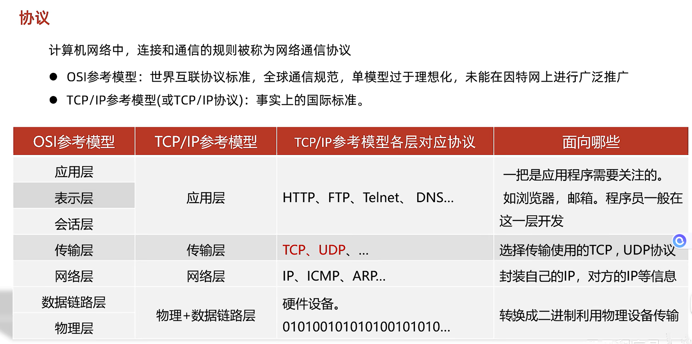

## 网络编程
### 网络编程三要素
1. IP: 设备在网络中的地址，是唯一的标识
2. 端口号：应用程序在设备中唯一的标识。
3. 协议：数据在网络中传输的规则
   常见的协议有：UDP，TCP，http，https，ftp

```java
        InetAddress address = InetAddress.getByName("Hanxing");
        System.out.println(address);

        String name = address.getHostName();
        System.out.println(name);

        String ip = address.getHostAddress();
        System.out.println(ip);
```

#### 协议


##### UDP协议


- 传递数据
```java
    public static void main(String[] args) throws IOException {
//        1. 创建DatagramSocket对象(快递公司)
//        2. 细节：绑定端口，以后我们就是通过这个端口往外发送
//        3. 空参: 所有可用的端口中随机一个进行使用
//        4. 有参: 指定端口号进行绑定
        DatagramSocket ds = new DatagramSocket();

        String str = "你好";
        byte[] bytes = str.getBytes();
        InetAddress address =  InetAddress.getByName("127.0.0.1");
        int port = 10086;

        DatagramPacket dp = new DatagramPacket(bytes, bytes.length, address, port);

        ds.send(dp);
        ds.close();

    }
```
- 接收数据
```java
public static void main(String[] args) throws IOException {

        //1. 创建DatagramSocket对象
        //细节：
        //在接收的时候，一定要绑定端口
        //而且绑定的端口一定要跟发送的端口保持一致
        DatagramSocket ds = new DatagramSocket(10086);

        byte[] bytes = new byte[1024];
        DatagramPacket dp = new DatagramPacket(bytes, bytes.length);
        ds.receive(dp);

        byte[] date = dp.getData();
        int len = dp.getLength();

        InetAddress address = dp.getAddress();
        int port = dp.getPort();

        System.out.println("接收到数据" + new String(date, 0, len));
        System.out.println("该数据是从" + address + "这台电脑中的" + port + "这个端口发出的");

        ds.close();
    }
```


##### TCP协议


- 接收数据
  ```java
      public static void main(String[] args) throws IOException {
        ServerSocket ss = new ServerSocket(10086);

        Socket socket = ss.accept();

        InputStream is = socket.getInputStream();

        int b;
        while ((b = is.read()) != -1) {
            System.out.println((char) b);
        }

        is.close();
        ss.close();
    }
  ```

- 发送数据
```java
    public static void main(String[] args) throws IOException {
        Socket socket = new Socket("127.0.0.1", 10086);

        OutputStream os = socket.getOutputStream();
        os.write("aaa".getBytes());

        os.close();
        socket.close();
    }
```