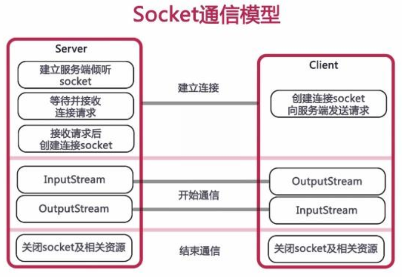

## 网络编程
在了解什么是网络编程之前，一些网络编程的基础知识你得要掌握
https://blog.csdn.net/weixin_44141495/article/details/108190461

### 网络编程三要素
1. IP: 设备在网络中的地址，是唯一的标识
2. 端口号：应用程序在设备中唯一的标识。
3. 协议：数据在网络中传输的规则
   常见的协议有：UDP，TCP，http，https，ftp

```java
        InetAddress address = InetAddress.getByName("Hanxing");
        System.out.println(address);

        String name = address.getHostName();
        System.out.println(name);

        String ip = address.getHostAddress();
        System.out.println(ip);
```

#### 协议


##### UDP协议


- 传递数据
```java
    public static void main(String[] args) throws IOException {
//        1. 创建DatagramSocket对象(快递公司)
//        2. 细节：绑定端口，以后我们就是通过这个端口往外发送
//        3. 空参: 所有可用的端口中随机一个进行使用
//        4. 有参: 指定端口号进行绑定
        DatagramSocket ds = new DatagramSocket();

        String str = "你好";
        byte[] bytes = str.getBytes();
        InetAddress address =  InetAddress.getByName("127.0.0.1");
        int port = 10086;

        DatagramPacket dp = new DatagramPacket(bytes, bytes.length, address, port);

        ds.send(dp);
        ds.close();

    }
```
- 接收数据
```java
public static void main(String[] args) throws IOException {

        //1. 创建DatagramSocket对象
        //细节：
        //在接收的时候，一定要绑定端口
        //而且绑定的端口一定要跟发送的端口保持一致
        DatagramSocket ds = new DatagramSocket(10086);

        byte[] bytes = new byte[1024];
        DatagramPacket dp = new DatagramPacket(bytes, bytes.length);
        ds.receive(dp);

        byte[] date = dp.getData();
        int len = dp.getLength();

        InetAddress address = dp.getAddress();
        int port = dp.getPort();

        System.out.println("接收到数据" + new String(date, 0, len));
        System.out.println("该数据是从" + address + "这台电脑中的" + port + "这个端口发出的");

        ds.close();
    }
```


##### TCP协议


- 接收数据
  ```java
      public static void main(String[] args) throws IOException {
        ServerSocket ss = new ServerSocket(10086);

        Socket socket = ss.accept();

        InputStream is = socket.getInputStream();

        int b;
        while ((b = is.read()) != -1) {
            System.out.println((char) b);
        }

        is.close();
        ss.close();
    }
  ```

- 发送数据
```java
    public static void main(String[] args) throws IOException {
        Socket socket = new Socket("127.0.0.1", 10086);

        OutputStream os = socket.getOutputStream();
        os.write("aaa".getBytes());

        os.close();
        socket.close();
    }
```


### Java Socket网络编程

Java的网络编程主要涉及到的内容是Socket编程。Socket，套接字，就是两台主机之间逻辑连接的端点。TCP/IP协议是传输层协议，主要解决数据如何在网络中传输，而HTTP是应用层协议，主要解决如何包装数据。**Socket是通信的基石，是支持TCP/IP协议的网络通信的基本操作单元**。它是网络通信过程中端点的抽象表示，包含进行网络通信必须的五种信息：**连接使用的协议、本地主机的IP地址、本地进程的协议端口、远程主机的IP地址、远程进程的协议端口**。

应用层通过传输层进行数据通信时，TCP会遇到同时为**多个应用程序进程提供并发服务**的问题。多个TCP连接或多个应用程序进程可能需要通过同一个TCP协议端口传输数据。为了区别不同的应用程序进程和连接，许多计算机操作系统为应用程序与TCP/IP协议交互提供了套接字（Socket）接口。**应用层可以和传输层通过Socket接口，区分来自不同应用程序进程或网络连接的通信，实现数据传输的并发服务。**

Socket，实际上是对TCP/IP协议的封装，Socket本身并不是协议，而是一个调用接口（API），通过Socket，我们才能使用TCP/IP协议。实际上，Socket跟TCP/IP协议没有必然的关系，Socket编程接口在设计的时候，就希望也能适应其他的网络协议。所以说，Socket的出现，只是使得程序员更方便地使用TCP/IP协议栈而已，是对TCP/IP协议的抽象，从而形成了我们知道的一些最基本的函数接口，比如create、listen、accept、send、read和write等等。网络有一段关于socket和TCP/IP协议关系的说法比较容易理解：

“TCP/IP只是一个协议栈，就像操作系统的运行机制一样，必须要具体实现，同时还要提供对外的操作接口。这个就像操作系统会提供标准的编程接口，比如win32编程接口一样，TCP/IP也要提供可供程序员做网络开发所用的接口，这就是Socket编程接口。”

实际上，传输层的TCP是基于网络层的IP协议的，而应用层的HTTP协议又是基于传输层的TCP协议的，而Socket本身不算是协议，就像上面所说，它只是提供了一个针对TCP或者UDP编程的接口。socket是对端口通信开发的工具,它要更底层一些。

### Socket 整体流程

Socket编程主要涉及到客户端和服务端两个方面，首先是在服务端创建一个服务器套接字**ServerSocket**， 并把它附加到一个端口上，服务器从这个端口监听连接。端口好的范围是0到65536，但是0到1024是为特权服务保留的端口号，我们可以选择任意一个当前没有被其他进程使用的端口。

客户端请求与服务器进行连接的时候，根据服务器的域名或者IP地址，加上端口号，打开一个套接字。当服务器接受连接后，服务器和客户端之间的通信**就像输入输出流一样操作**。



#### 样例

##### 实现客户端输入正方形边长，服务端返回正方形面积（一对一服务）

**服务器端**
```java
public static void main(String[] args){
        // 服务器端
        // 定义一个端口号
        int port = 6666;
        try(
                //在端口上创建一个服务器套接字
                ServerSocket serverSocket = new ServerSocket(port);
                // 监听来自客户端的连接
                Socket socket = serverSocket.accept();
        ) {
            DataInputStream dis = new DataInputStream(new BufferedInputStream(socket.getInputStream()));

            DataOutputStream dos = new DataOutputStream(new BufferedOutputStream(socket.getOutputStream()));

            // 这里面dis和dos 底层使用的socket,socket关闭了，这两个就可以不用考虑

            Double length = 0.0;
            do {
                length = dis.readDouble();
                System.out.println("服务器端收到边长数据为:" + length);

                double result = length * length;
                dos.writeDouble(result);

                dos.flush();
            }while (length != 0.0);
        } catch (IOException e) {
            throw new RuntimeException(e);
        }

    }
```

**客户端**
```java
public static void main(String[] args) {
        // 客户端
        int port = 6666;
        String host = "localhost";

        try (
                Socket socket = new Socket(host, port);
                // 创建一个套接字并将其连接到指定端口号

                DataInputStream dis = new DataInputStream(new BufferedInputStream(socket.getInputStream()));

                DataOutputStream dos = new DataOutputStream(new BufferedOutputStream(socket.getOutputStream()));

        ) {
            Scanner sc = new Scanner(System.in);
            System.out.println("请输入正方形边长:");
            Double number = 0.0;
            do {
                number = sc.nextDouble();
                dos.writeDouble(number);
                dos.flush();// 发送数据

                System.out.println("正方形面积为" + dis.readDouble());
            }while (number != 0.0);

        } catch (IOException e) {
            e.printStackTrace();
        }
    }
```

##### 实现客户端输入正方形边长，服务端返回正方形面积（多对一服务）
为了能让一个服务器端程序能同时为多个客户提供服务，可以使用多线程机制，每个客户端的请求都由一个独立的线程进行处理。下面是改写后的服务器端程序。

```java
public static void main(String[] args){
        // 服务器端
        // 定义一个端口号
        int port = 6666;

        int clientNo = 0;

        // 创建线程池 阿里巴巴手册规范，线程池必须这样创建
        ExecutorService exec = new ThreadPoolExecutor(
                3,
                5,
                60,
                TimeUnit.SECONDS,
                new ArrayBlockingQueue<>(3)
        );

        try( //在端口上创建一个服务器套接字
            ServerSocket serverSocket = new ServerSocket(port);
            ) {
            // 执行业务逻辑
            while (true) {
                //serverSocket.accept() 是一个阻塞方法，只有当有新的客户端连接时才会返回。
                Socket socket = serverSocket.accept();
                //调用线程池
                exec.execute(new SingleServer(socket, clientNo));
                clientNo++;
                System.out.println(clientNo + "当前线程数");
            }
        } catch (IOException e) {
            e.printStackTrace();
        }

    }
```

```java
class SingleServer implements Runnable {
    private Socket socket;
    private int clientNo;

    public SingleServer(Socket socket, int clientNo) {
        this.socket = socket;
        this.clientNo = clientNo;
    }

    @Override
    public void run() {
        try(
                DataInputStream dis = new DataInputStream(
                        new BufferedInputStream(socket.getInputStream()));
                DataOutputStream dos = new DataOutputStream(
                        new BufferedOutputStream(socket.getOutputStream()));
        ) {
            Double length = 0.0;
            do {
                length = dis.readDouble();
                System.out.println("服务器端收到边长数据为:" + length);

                double result = length * length;
                dos.writeDouble(result);

                dos.flush();
            }while (length != 0.0);
        } catch (IOException e) {
            throw new RuntimeException(e);
        }
    }
}
```

##### 实现远程文件传输

**服务端**
```java
 public static void main(String[] args){
        // 服务端
        // 先定义一个端口port
        int port = 6666;
        try(
                // 在端口创建一个服务器套接字
                ServerSocket serverSocket = new ServerSocket(port);
                // 监听来自端口的连接
                Socket socket = serverSocket.accept();

                // 创建输入流
                InputStream is = socket.getInputStream();
                // 创建输出流
                BufferedOutputStream bos = new BufferedOutputStream(new FileOutputStream("b.txt"));

        ) {
            byte[] bytes = new byte[1024];
            int len = 0;
            while ((len = is.read(bytes)) != -1) {
                bos.write(bytes, 0, len);
                System.out.println(new String(bytes, 0, len));
                System.out.println("执行到这里了");
            }

            bos.flush();
            System.out.println("写入完毕");
            //将上传完毕的信息返回给客户端
            OutputStream os = socket.getOutputStream();
            os.write("写入完毕".getBytes());
            os.flush(); // 确保消息发送

        } catch (IOException e) {
            e.printStackTrace();
        }

    }
```

**客户端**

```java
    public static void main(String[] args) {
        // 定义端口
        int port = 6666;

        try(
                // 创建端口 客户端套接字
                Socket socket = new Socket("localhost", port);
                // 创建本地输入流
                BufferedInputStream bis = new BufferedInputStream(
                        new FileInputStream("a.txt"));
                // 创建输出流
                OutputStream os = socket.getOutputStream();
        ) {
            // 先从本地读入文件
            byte[] bytes = new byte[1024];
            int len = 0;
            while ((len = bis.read(bytes)) != -1) {
                os.write(bytes, 0, len);
                //再发送文件
//                System.out.println(new String(bytes, 0, len));
            }

            // 确保数据发送完成
            os.flush();
            // 打印发送完毕
            System.out.println("发送完毕");
            socket.shutdownOutput();//要关闭输出流，才可以让服务端认为数据已经传输完毕，否者会一直主阻塞

            // 获取服务器返回信息
            InputStream isByService = socket.getInputStream();
            while ((len = isByService.read(bytes)) != -1) {
                System.out.println(new String(bytes, 0, len));
            }


        } catch (IOException e) {
            throw new RuntimeException(e);
        }
    }
```

##### UDP实现简易聊天室
```java
public static void main(String[] args) throws Exception {
    DatagramSocket socket=new DatagramSocket(6668);
    while(true) {
    //2、准备接受包裹
    byte[] datas=new byte[1024];
    DatagramPacket packet=new DatagramPacket(datas,0,datas.length);
    socket.receive(packet);//阻塞式接受

    //3、输出包裹并准备断开连接 bye
    byte[] data=packet.getData();
    String receiveData=new String(data,0,data.length);
    System.out.println(receiveData);

    if(receiveData.trim().equals("bye")) {//不加trim会由于发出来的包里面含有大量空格导致无法比较，需要删掉空格
        break;
    }        
    }
    socket.close();
}
```

```java
public static void main(String[] args) throws Exception {
        DatagramSocket socket=new DatagramSocket(8888);

        while(true) {
        //2、准备数据
        BufferedReader  reader=new BufferedReader(new InputStreamReader(System.in));

        String data=reader.readLine();
        byte[] datas=data.getBytes();
        DatagramPacket packet=new DatagramPacket(datas, 0,datas.length,new InetSocketAddress("localhost",6668));

        //3、发送数据
        socket.send(packet);
        if(data.equals("bye")) {
            break;
        }
        }

        socket.close();
    }
```