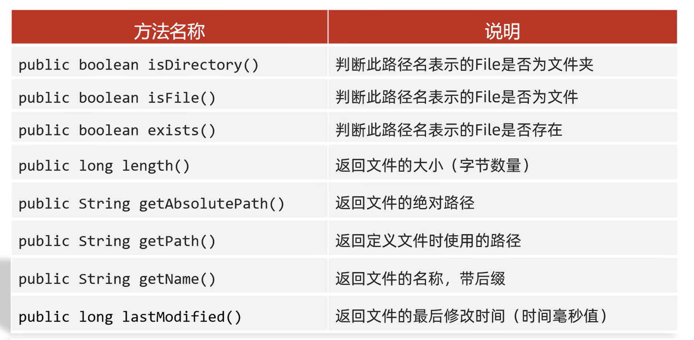
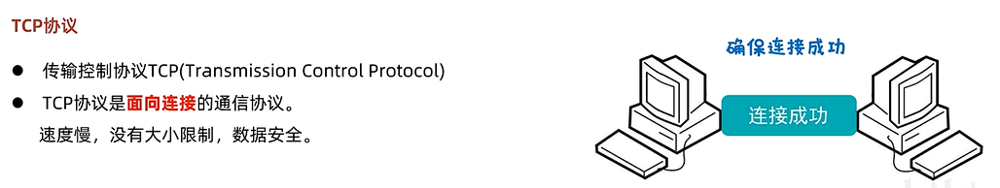
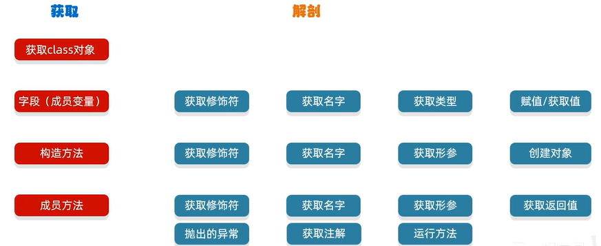
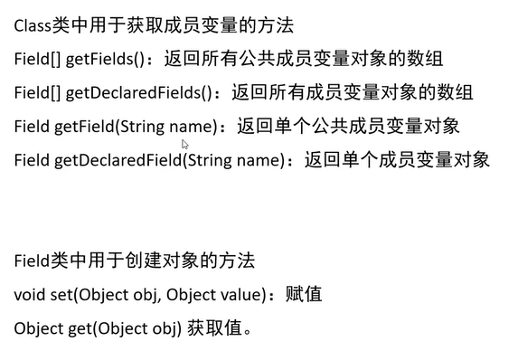
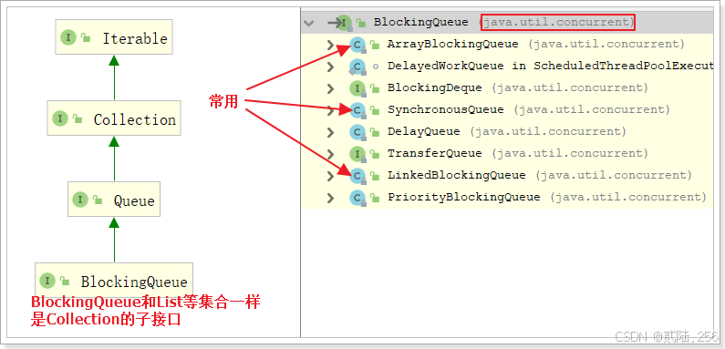

## java中的集合
java中定义了很多集合：
LinkedHashSet
TreeSet
Map
LinedHashMap
HashSet
Vector
TreeMap
HashMap
LinkedList
Collection
Map
ArrayList

### ArrayList
使用ArrayList的方法
```java
JDK7之前
ArrayList<String> list = new ArrayList<String>();
JDK7以后
ArrayList<String> list = new ArrayList<>();
```
***ArrayList只可以添加引用类型，不可以添加基本数据类型，需要先讲基本数据类型变为包装类***


## 集合体系结构
### 单列集合 Collection
#### List系列集合
List系列集合：添加的元素是有序、可重复、有索引。
<br>
**Collection**

***这里面contains方法的底层源码是依赖equals方法进行判断是否存在的，所以，如果集合中存储的是自定义对象，也想通过contains方法来判断是否包含，那么在javabean类中，一定要重写equals方法。***
**Collection的遍历方式**
1. 迭代器遍历
   迭代器在Java中的类是Iterator，迭代器是集合专用的遍历方式。
   ```java
   Iterator<String> it = list.iterator();
   while(it.hasNext()) {
    String str = it.next();
    system.out.print(str + " ");
   }
   ```

   一些注意事项：
   - 可能的报错NoSuchElementException
   - 迭代器遍历完毕，指针不会复位
   - 循环中只能用一次next方法
   - **迭代器遍历时，不能用集合的方法进行增加或者删除。**可以用迭代器提供的remove来删除，添加暂时没有办法

2. 增强for遍历
   增强for的底层就是迭代器，为了简化迭代器的代码书写的。
   只有单列集合和数组才能用增强for进行遍历
   ```java
   for (元素的数据类型 变量名：数组或则集合) {

   }
   ```

3. Lambada表达式遍历
   得益于JDK8开始的新技术Lambda表达式，提供了一种更简单，更直接的遍历集合的方式
   default void forEach(Consumer<? super T> action):
   结合lambda遍历集合
   ```java
   coll.forEach(new Consumer<String>() {
    @Override
    //s依次表示集合中每一个数据
    public void accept(String s) {
      System.out.println(s);
    }
   })

   coll.forEach(s -> system.out.println(s));
   ```

##### List集合的特点
- 有序：存和取的元素顺序一致
- 有索引：可以通过索引操作元素
- 可重复：存储的元素可以重复

Collection的方法List都继承了
由于List集合有索引，所以多了很多索引操作的方法。


List集合多了一种列表迭代器
可以在遍历的过程中添加元素


###### ArrayList
这个用的比较多，就不多写了
###### LinkedList
最底层实现的其实就是双向链表

一些特殊的API：



#### Set系列集合
Set系列集合：添加的元素是无序、不重复、无索引。
无序：存取顺序不一致
不重复：可以去除重复
无索引：没有带索引的方法，所以使用普通for循环遍历，也不能通过索引来获取元素

**Set接口中的方法上基本与Collection的API一致**

##### HashSet
无序、不重复、无索引
- HashSet集合底层采取哈希表存储数据
- 哈希表是一种对于增删改查数据性能都比较好的结构
在JDK8之前：数组+链表
在JDK8开始：数组+链表+红黑树
当链表长度超过8，而且数组长度大于等于64时，自动转换为红黑树。

如果集合中存储的是自定义对象，必须要重写hashCode和equals方法



##### LinkedHashSet
LinkedHashSet相比HashSet多添加了一个双链表的操作，因此存取有序。

**我们一般还是使用HashSet**，除非要求**去重并且存取有序**，才使用LinkedHashSet。
##### TreeSet
不重复、无索引、可排序
可排序：按照元素的默认规则(由小到大)排序
**TreeSet集合底层是基于红黑树的数据结构实现排序，因此增删改查性能都较好**


### 双列集合 Map

 

 #### Map的常见API
 

 #### Map的遍历方式
 - 第一种遍历方式
 ```java
 Map<String, String> map = new HashMap<>();
 map.put("我是"."傻逼");
 map.put("你是","天才");
 map.put("他是","水货");

 Set<String> keys = map.keySet();
 //1. 增强for遍历
 for (String key : keys) {
   String value = map.get(key);
   System.out.println(value);
 }
 //2. 迭代器的形式进行遍历
   Iterator<String> it = map.keySet().iterator();
   while(it.hasNext()) {
      String value = map.get(it.next());
      System.out.println(value);
   }

   System.out.println("--------------------------------");
   //forEach遍历方式
   map.forEach(new BiConsumer<String, String>() {
      @Override
      public void accept(String s, String s2) {
            System.out.println(s2);
      }
   });

   System.out.println("--------------------------------");

   map.forEach((String s, String s2) -> System.out.println(s2));
 
 ```
- 第二中Map集合的第二种遍历方式
  通过键值对对象进行遍历
  通过一个方法获取所有的键值对对象，返回一个Set集合

```java
Map<String, String> map = new HashMap<>();
map.put("我是","傻逼");
map.put("你是","天才");
map.put("他是","智障");

Set<Map.Entry<String, String>> entries = map.entrySet();
for (Map.Entry<String, String> entry : entries) {
   System.out.println(entry.getValue());
}
System.out.println("-----------------------------");
entries.forEach(new Consumer<Map.Entry<String, String>>() {
   @Override
   public void accept(Map.Entry<String, String> stringStringEntry) {
         System.out.println(stringStringEntry.getValue());
   }
});
System.out.println("-----------------------------");
entries.forEach(stringStringEntry -> System.out.println(stringStringEntry.getValue()));
System.out.println("-----------------------------");

Iterator it = entries.iterator();
while(it.hasNext()) {
   Map.Entry<String, String> entry= (Map.Entry<String, String>) it.next();
   System.out.println(entry.getValue());
}
```
#### HashMap
- HashMap是Map里面的一个实现类
- 没有额外需要学习的特有方法，直接使用Map里面的方法就可以了
- 特点都是**由键决定**的：无序，不重复，无索引
- HashMap跟HashSet底层原理是一模一样的，都是哈希表结构。

#### LinedHashMap
- **由键决定**：有序、不重复、无索引；
- 这里的有序是指，存储与取出的元素顺序保持一致
- **原理**：底层数据结构依然是哈希表，只是对每一个键值对又额外多了一个双链表的机制记录存储的顺序。

#### TreeMap
- TreeMap跟TreeSet底层原理一样，都是红黑树结构
- 由键决定特性：不重复、无索引、可排序
- 可排序：对键进行排序
- 注意：默认按照键的从小到大排序，也可以自己规定键的排序规则

代码书写两种排序规则：
 1. 实现Comparable接口，制定比较规则
 2. 创建集合时传递Comparator比较器对象，制定比较规则
 3. 如果两者同时实现，则以第二种为原则


**练习**
```java
public class Test {
    public static void main(String[] args) {
        TreeMap<Integer, String> products = new TreeMap<>(new Comparator<Integer>() {
            @Override
            public int compare(Integer o1, Integer o2) {
                return o1 - o2;
            }
        });

        products.put(1,"key");
        products.put(4,"door");
        products.put(3,"water");

        products.forEach((id,name) -> System.out.println(id + " " + name));

        System.out.println("===============================");

        TreeMap<Student, String> students = new TreeMap<>();
        students.put(new Student("zhangxu",20),"江西");
        students.put(new Student("zhang18",18),"四川");
        students.put(new Student("hanxing",20),"中国");

        students.forEach((stu,place) -> System.out.println(stu + " " + place));
    }

}

class Student implements Comparable<Student>{
    private String name;
    private int age;


    public Student() {
    }

    public Student(String name, int age) {
        this.name = name;
        this.age = age;
    }

    /**
     * 获取
     * @return name
     */
    public String getName() {
        return name;
    }

    /**
     * 设置
     * @param name
     */
    public void setName(String name) {
        this.name = name;
    }

    /**
     * 获取
     * @return age
     */
    public int getAge() {
        return age;
    }

    /**
     * 设置
     * @param age
     */
    public void setAge(int age) {
        this.age = age;
    }

    public String toString() {
        return "Student{name = " + name + ", age = " + age + "}";
    }

    @Override
    public boolean equals(Object o) {

        if (this == o) return true;
        if (o == null || getClass() != o.getClass()) return false;
        Student student = (Student) o;
        return age == student.age && Objects.equals(name, student.name);
    }

    @Override
    public int hashCode() {
        return Objects.hash(name, age);
    }

    @Override
    public int compareTo(Student o) {

        if (this.getAge() - o.getAge() != 0) {
            return this.getAge() - o.getAge();
        } else {
            return this.getName().charAt(0) - o.getName().charAt(0);
        }
    }
}
```

#### Map的底层原理
