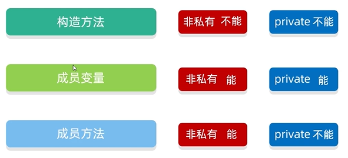
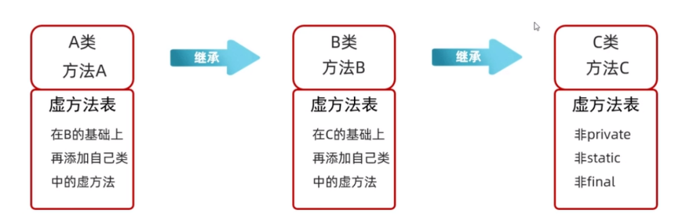
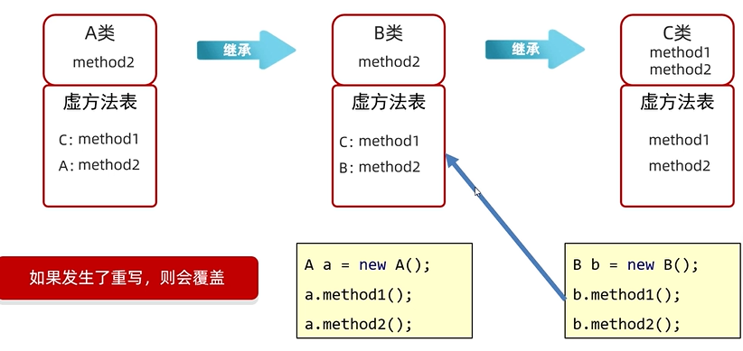
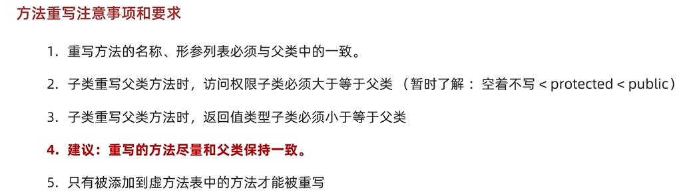
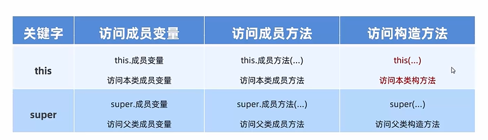

## 封装
对象代表什么，就得封装对应的数据，并提供数据对应的行为。

#### private 关键字
private是一个权限修饰符
可以修饰成员（成员变量和成员方法）
被***private***修饰的成员只能在本类中才能访问’


## 继承
当类与类之间，存在相同（共性）的内容，并且满足子类是父类中的一种，就可以考虑使用继承来优化代码。

继承的格式
```java
public class 子类 extends 父类 {
}
```
继承后子类可以得到父类的属性和行为，子类可以使用。**子类无法访问父类的私有成员。**
子类可以在父类的基础上新增其他功能，子类更加强大。

**重点**:
1. 子类到底能继承父类中的哪些内容
   
   - 父类的构造方法不能被子类继承
   - 成员变量都可以被继承，但是私有的成员变量不能被直接使用
   - 在java中，虚拟机会再类的方法区建立一个虚拟方法表的数据结构，由**非private，非static，非final修饰**的方法组成的常用方法列表
    在一段继承结构中：会从顶级父类开始把自己常用的方法抽取出来放到自己的虚方法表中，并在里面加上自己的常用方法，并将虚方法表交给自己的子类，以此反复
    **在虚方法的添加结束后，每一个类都有自己的虚方法表，其中包含自己和自己所有父类的常用方法**
    
2. 继承中：成员变量的访问特点
   
3. 继承中：成员方法的访问特点
4. 继承中：构造方法的特点
5. this、super的使用总结 

java中只支持**单继承**，不支持**多继承**，但支持**多层继承**。

### 方法的重写
当父类的方法不能满足子类现在的需求时，需要进行方法重写。

@Override重写注解
1. @Override是放在重写后的方法上，校验子类重写时语法是否正确。
2. 加上注解后如果有红色波浪线，表示语法错误。
3. 建议重写方法都加上@Override注解，代码安全，优雅！

**方法重写的本质**




### 继承中构造方法的访问特点
- 父类中的构造方法不会被子类继承
- 子类中所有的构造方法默认先访问父类中的无参构造，再执行自己。
- 如果想要访问父类的有参构造，必须手动书写。

为什么？
- 子类在初始化的时候，有可能会使用到父类中的数据，如果父类没有完成初始化，子类将无法使用父类的数据。
- 子类初始化之前，一定要调用父类构造方法先完成父类数据空间的初始化。

怎么调用父类构造方法的？
- 子类构造方法的第一行语句默认都是：**super()，不写也存在，并且必须在第一行**。

## this和super的使用总结


## 多态
什么是多态，同类型的对象，表现出的不同形态

多态的表现形式
父类类型 对象名称 = 子类对象；

多态的前提
 - 有继承关系
 - 有父类引用指向子类对象
 - 有方法重写

### 多态调用成员的特点
变量调用：编译看左边，运行也看左边
方法调用：编译看左边，运行看右边
```java
class Animal{
  String name = "动物";

  public void show() {}
    System.out.println("Animal 的 show()");
}

class Dag extends Animal{
  String name = "Dog";

  public void show() {
    System.out.println("Cat 的 Show()");
  }
}
```
对于上面的代码，如果有以下代码：
```java
Animal a = new Dog();
System.out.println(a.name);
```
**打印的结果为： 动物**
***调用成员变量：编译看左边：javac编译代码的时候，会看左边的父类中有没有这个变量，如果有，编译成功，如果没有编译失败***
<br>
***运行也看左边：java运行代码的时候，实际获取的是左边父类中成员变量的值；***

```java
Animal a = new Dog();
a.show();
```
**打印的结果为：Cat 的 Show()**
***编译看左边：javac编译代码的时候，会看左边的父类中有没有这个方法，如果有，编译成功，如果没有编译失败。***
***运行看右边：java运行代码的时候，实际上运行的是子类中的方法。***

### 多态的优势
- 在多态形式下，右边的对象可以实现解耦合，便于扩展和维护。
- 定义方法的时候，使用父类型作为参数，可以接收所有子类对象，体现多态的扩展性与便利。

关键字：**instanceof**
```java
if(a instanceof Dog) {
  Dog d = (Dog) a;
  d.lookHome();
}else if (a instanceof Cat) {
  Cat c = (Cat) a;
  c.catchMouse();
}else {
  System.out.println("没有这个类型，无法转换");
}
```
**新特性** 就是将强转直接改为了一行代码
```java
if (a instanceof Dog d) {
  d.lookHome();
} else if (a instanceof Cat c) {
  c.catchMouse();
} else {
  System.out.println("没有这个类型");
}
```