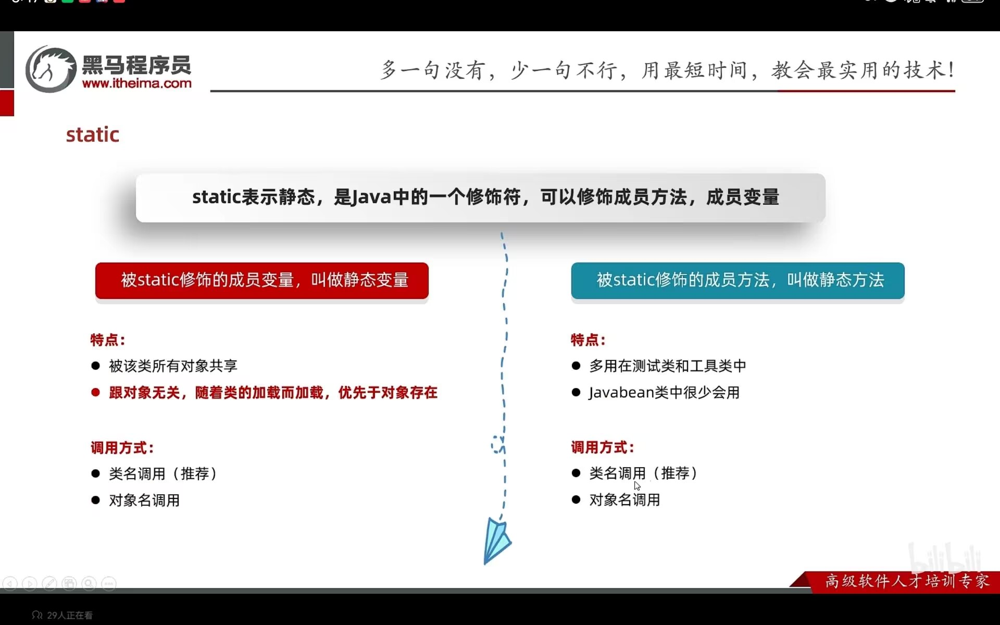
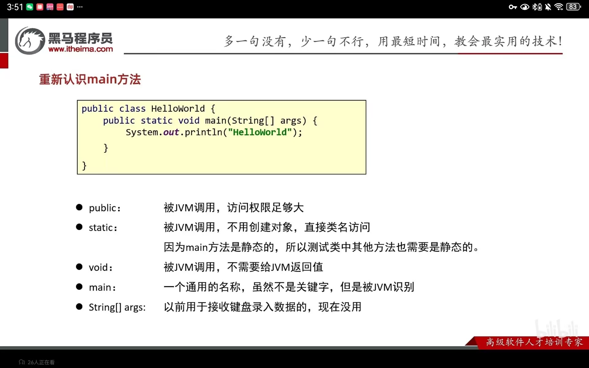

## 面相对象进阶
### static 修饰符

#### static 静态变量
被static修饰的成员变量，叫做静态变量
**静态变量是随着类的加载而加载的，优先于对象出现的。静态变量存储在静态区中（堆内存），是对象共享的**
1. 被static修饰的成员变量，叫做静态变量
   - 被该类的所有对象共享
     - 可以使用类名调用（推荐）
     - 也可以使用对象名调用

#### static 静态方法
被static修饰的成员方法，叫做静态方法
特点：
  - 多用在测试类和**工具类**中
  - javabean类中很少会用

调用方式：
  - 类名调用（推荐）
  - 对象名调用

static的注意事项：
- 静态方法**只能**访问静态变量和静态方法
- 非静态方法可以访问静态变量或者静态方法，**也可以**访问非静态的成员变量和非静态的成员方法
- 静态方法中是没有**this关键字**

### 重新认识main方法

**测试类中的其他方法也需要是静态的**